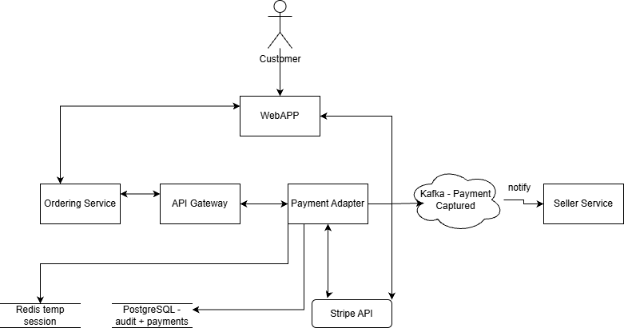
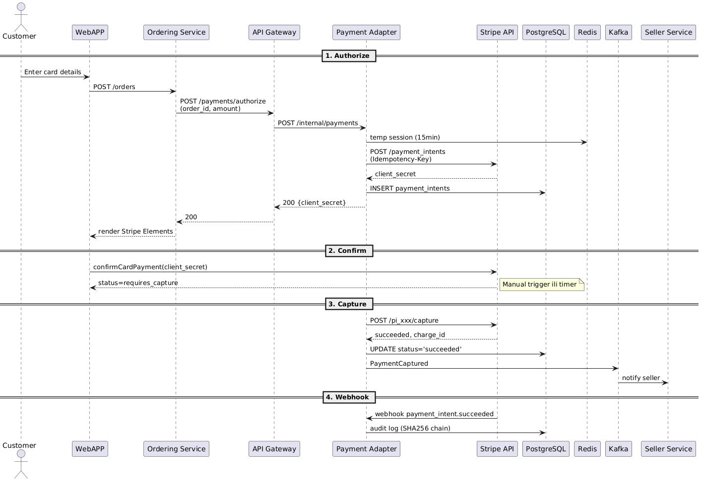
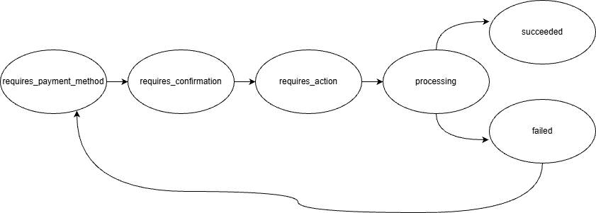

# Payment Adapter Analiza 
###### Teodor Vidaković R213/2025

Payment Adapter je izolovan mikroservis implementiran u Rustu koji služi kao secure bridge između internog Ordering Service-a i eksternih payment provajdera (Stripe). Adapter upravlja celokupan lifecycle plaćanja: authorize, capture, refund, chargeback handling. To radi bez čuvanja osetljivih kartičnih podataka na serveru, čime minimizuje PCI DSS compliance scope na SAQ A nivo. Koristi Stripe Payment Intents API za stateful upravljanje transakcijama, webhook-ove za asinhronu notifikaciju promena, i Kafka event bus za propagaciju payment event-ova downstream servisima (Seller Service).


---

## Komponente Sistema

| Komponenta | Tehnologija | Odgovornost | Persistencija |
|------------|-------------|-------------|---------------|
| **Customer** | Browser | Inicira checkout, unosi card podatke u Stripe iframe | N/A |
| **Customer WebApp** | React + Stripe.js | Renderuje Stripe Elements, izvršava `confirmCardPayment()` client-side | LocalStorage (session token) |
| **Payment Adapter** | Rust + Stripe SDK | Upravlja  payment lifecycle, verifikuje webhooks, publishes Kafka events | N/A (stateless) |
| **PostgreSQL** | PostgreSQL 15 | Čuva: (1) Stripe API keys (encrypted), (2) Payment records (`payment_intent_id`, `status`, `order_id`), (3) Webhook idempotency log (`event_id`, `processed_at`) | Persistent (primary datastore) |
| **Redis** | Redis 7 (cluster) | Session cache: `client_secret` → `{order_id, amount, created_at}` mapping; Rate limiting; Webhook deduplication locks | In-memory (TTL 5min) |
| **Stripe API** | External SaaS | Procesira payments, izvršava 3DS, šalje webhooks | External (Stripe infrastruktura) |
| **Kafka** | Kafka 3.x | Async notifikacija downstream servisa, poput Seller servisa | Topics: `PaymentSucceeded`, `PaymentFailed`, `ChargebackDetected` |


Za [PCI compliance](https://www.fortra.com/blog/what-pci-compliance), adapter koristi Stripe Elements za tokenizaciju na klijentu, izbegavajući rukovanje PAN-om (PCI SAQ A). Secrets (Stripe API ključevi). Audit logovi idu u PostgreSQL sa tamper-proof hash-ovima. Preporuka je da se nikad ne čuva PII u Redis-u.

### Dijagram toka podataka



## Sekvencijalni dijagram




## Stripe API

Prema **[Stripe API Tour](https://docs.stripe.com/payments-api/tour)**, svaki payment koristi **PaymentIntent state machine** koja prati lifecycle transakcije (payment može biti otkazan u bilo kom trenutku prije processinga):




### API Resursi (Core Objects)

Stripe API je organizovan oko **resursa**. To je entitet koji predstavlja podatke o transakcijama. Svaki resurs je JSON objekat sa jedinstvenim ID-em (`id`), statusom lifecycle-a, i related properties. Pristupa im se preko REST endpoints-a (npr. `/v1/payment_intents/{id}`).

| API Resurs | Šta predstavlja i uloga u sistemu | Ključni lifecycle statusi | Primer JSON strukture |
|------------|-----------------------------------|---------------------------|-----------------------|
| **PaymentIntent** | Predstavlja **nameru izvršenja plaćanja**. Centralni orchestration objekat koji prati ceo tok transakcije od kreiranja do finalizacije. Enkapsulira amount, currency, payment method type, i metadata (npr. `order_id` za linking sa Order sistemom). Održava state machine koja omogućava retry logiku bez kreiranja novog objekta. Automatski handluje 3DS autentifikaciju i SCA compliance. | `requires_payment_method` → `requires_confirmation` → `processing` → `succeeded` (ili `requires_capture` za manual flow) | `{id: "pi_xxx", amount: 5000, currency: "usd", status: "succeeded", metadata: {order_id: "O-123"}}` |
| **PaymentMethod** | Predstavlja **tokenizovani payment instrument** (kartica, SEPA Direct Debit, iDEAL). **Ne sadrži** real card brojeve. Umesto toga čuva `fingerprint` i `last4` cifre. Kreira se client-side što eliminiše PCI scope (kartica nikada ne prolazi kroz server). Može biti `attached` na Customer objekat za reusable payments (saved cards). | `attached` (povezan sa Customer-om) / `detached` (one-time use, nije saved) | `{id: "pm_xxx", type: "card", card: {brand: "visa", last4: "4242", fingerprint: "xyz"}}` |
| **Charge** | Predstavlja **pojedinačan pokušaj transfer-a sredstava** sa payment method-a na Stripe account. PaymentIntent može imati **više Charge objekata** ako dođe do retries (npr. 3DS failure pa ponovo, insufficient funds pa ponovo sa drugim metodom). Sadrži detaljne `outcome` podatke (network status, risk evaluation, decline code). Legacy API, za nove integracije koristiti PaymentIntent. | `succeeded` (sredstva uspešno naplaćena/rezervisana) / `failed` (odbijen - npr. `insufficient_funds`, `card_declined`) / `pending` (async metodi kao SEPA) | `{id: "ch_xxx", amount: 5000, status: "succeeded", outcome: {network_status: "approved_by_network", risk_level: "normal"}}` |

### Mehanizmi Notifikacije (Event System)

**Event** objekat i **Webhook** mehanizam omogućavaju asinhronu notifikaciju aplikacije o promenama stanja u Stripe accountu.

| Komponenta | Šta predstavlja | Kako funkcioniše | Primer strukture/eventa |
|------------|-----------------|------------------|-------------------------|
| **Event Object** | JSON objekat koji enkapsulira **šta se desilo** (`type`), **kada** (`created` timestamp), i **snapshot podataka** u trenutku eventa (`data.object`). Ne menja se čak ni ako se related resurs kasnije update-uje. Svaki event ima unique `id` za idempotency tracking. | Kreiran od Stripe-a svaki put kada se desi promena (payment uspe, kreira se dispute, subscription obnavlja). Dostupan preko API-a (`GET /v1/events/{id}`) ili webhook delivery. Sadrži **snapshot** objekta u `data.object`, npr. ceo PaymentIntent JSON u trenutku `payment_intent.succeeded` eventa. | `{id: "evt_xxx", type: "payment_intent.succeeded", data: {object: {id: "pi_xxx", amount: 5000, status: "succeeded"}}}` |
| **Webhook Endpoint** | HTTP POST callback sa servera Stripe-a ka aplikaciji. Šalje Event objekat kao JSON payload. Verifikovan preko `Stripe-Signature` header-a (HMAC SHA-256) da spreči replay attacks. | Kada se desi event (npr. `charge.dispute.created`), Stripe šalje POST request na registrovan URL (npr. `https://yourdomain.com/webhooks/stripe`). Server mora odgovoriti sa `2xx` statusom **pre timeout-a** (30s). Kompleksna logika ide u async queue. Retry ako endpoint ne odgovori. | Event types: `payment_intent.succeeded`, `payment_intent.payment_failed`, `charge.dispute.created`, `invoice.payment_failed` |

### Mapping u internu arhitekturu

Kada Webhook primi event, Payment Adapter izvršava sledeće akcije:

| Stripe Event Type | Akcija u Payment Adapter-u | Kafka Topic | Downstream Consumers |
|--------------------|---------------------------|-------------|----------------------|
| `payment_intent.succeeded` | Verify signature → Idempotency check (PostgreSQL) → Extract `metadata.order_id` → Update `payment_status='completed'` | `PaymentSucceeded` | Order Service (fulfillment), Analytics Service (metrics), Notification Service (email) |
| `payment_intent.payment_failed` | Log `last_payment_error.code` → Update status → Increment retry counter | `PaymentFailed` | Customer Service (notify user), Fraud Detection (pattern analysis) |
| `charge.dispute.created` | Extract `dispute.reason` → Create audit record → Block payout → Trigger investigation | `ChargebackDetected` | Seller Service (notify merchant), Risk Management (update fraud score) |
| `payment_intent.requires_action` | Ne procesira se server-side, već client-side | N/A | N/A |

---

# Rust Platform - Pregled Komponenti

Rust toolchain se sastoji od kompajlera, standardne biblioteke, build sistema i pomoćnih alata za razvoj. Kada instaliramo Rust preko `rustup` alata, dobijamo pristup sledećim komponentama koje omogućavaju razvoj, kompilaciju i distribuciju Rust programa. Rust bundluje sve neophodne komponente u jedinstveni toolchain.

### rustc - Rust Kompajler

`rustc` je zvanični Rust kompajler koji transformiše izvorni kod u izvršne binarne fajlove kroz multi-pass arhitekturu sa više međureprezentacija (IR):

1. **Lexer i Parser**: Konvertuje izvorni kod u token stream i gradi Abstract Syntax Tree (AST)
2. **HIR (High-level IR)**: AST se pretvara u HIR za type checking i trait resolution
3. **MIR (Mid-level IR)**: HIR postaje Control Flow Graph koji omogućava borrow checking, optimizacije, i monomorphization (instanciranje generičkog koda sa konkretnim tipovima)
4. **LLVM Backend**: MIR se kompajlira u LLVM-IR koji se optimizuje i prevodi u mašinski kod za ciljnu platformu

Kompajler koristi query-based arhitekturu koja omogućava inkrementalnu kompilaciju. Rezultati type checking-a, borrow checking-a i drugih analiza se keširaju na disku, tako da recompile izvršava samo izmenjene module. Ovo drastično ubrzava rebuild vreme u iterativnom development workflow-u, posebno za velike codebase-ove sa stotinama crate-ova. Kompajler je napisan u Rust-u i koristi bootstrapping, tj.prethodna stabilna verzija kompajlira novu, čineći Rust compiler konstantnim korisnikom sopstvenog jezika.

### cargo - Build Sistem i Package Manager

Cargo je zvanični build alat i package manager koji upravlja celokupnim životnim ciklusom Rust projekata; od razrešavanja zavisnosti preko kompilacije do objavljivanja na crates.io registry-ju. Cargo radi sa **crate**-ovima (paketima) definisanim u `Cargo.toml` manifest fajlu koji deklarativno određuje metadata (ime, verziju, autore), zavisnosti sa semantic versioning ograničenjima (`serde = "1.0"`), i build konfiguraciju. Cargo automatski preuzima stablo zavisnosti sa crates.io registry-ja, razrešava konflikte verzija, kompajlira sve crate-ove u pravilnom redosledu, i povezuje ih u finalni binarni fajl ili biblioteku.

Cargo integriše testiranje (`cargo test`), benchmarking (`cargo bench`), dokumentaciju (`cargo doc`), i publishing workflow (`cargo publish`) u jedinstveni interfejs. Za prilagođavanje build procesa, `build.rs` skripta omogućava proizvoljni Rust kod koji se izvršava pre kompilacije. Koristi se za generisanje koda, povezivanje native biblioteka, ili platform-specifičnu konfiguraciju. `Cargo.lock` fajl čuva tačne verzije svih zavisnosti da osigura identične build-ove na svim mašinama. Za razliku od Maven/Gradle XML/Groovy konfiguracije, Cargo koristi TOML format zbog čitljivosti i jednostavnosti.

### std - Standardna Biblioteka

`std` je potpuna standardna biblioteka koja pruža fundamentalne tipove (Vec, String, HashMap), I/O apstrakcije (File, TcpStream), concurrency primitive (thread, Mutex, Arc), i sistemske interfejse (filesystem, networking, process management). Biblioteka zahteva operativni sistem jer zavisi od heap alokacije, file I/O, threading-a, i drugih OS servisa. Po tome se razlikuje od `core` biblioteke koja je OS-agnostic.

`std` je automatski dostupna u scope-u svakog Rust programa preko prelude-a (`use std::prelude::v1::*;`), što importuje osnovne tipove (Option, Result, Vec, Box) bez eksplicitnog uvoza. Arhitektura biblioteke je slojevita: `std` re-exportuje `core` i `alloc`, što znači da `std::vec::Vec` je zapravo alias za `alloc::vec::Vec`. `std` garantuje stabilnost API-ja, tj. kod napisan za Rust 2015 edition će se kompajlirati i u Rust 2024 toolchain-u bez breaking promena.

### rustfmt - Formater Koda

`rustfmt` je zvanični formater koda koji automatski formatira Rust kod prema style smernicama definisanim u `rustfmt.toml` konfiguraciji. Integriše se u editor workflow (automatsko formatiranje pri snimanju u VS Code) i CI pipeline (`cargo fmt --check` u pre-commit hook-ovima) da osigura konzistentan stil koda kroz ceo tim. Formater parsira izvorni kod u AST i zatim ga ponovo ispisuje u formatiranom obliku. Samo sintaksno validan kod može biti formatiran, dok se sintaksne greške prijavljuju bez formatiranja. Za razliku od ClangFormat-a koji ima stotine konfiguracijskih opcija, `rustfmt` je opinionated sa malim setom podestivih parametara.

### clippy - Lint Alat

Clippy je napredni lint alat koji detektuje code smell-ove, anti-paterne, i probleme sa performansama koje kompajler ne detektuje. Implementira se kao rustc plugin koji pristupa kompajler IR-u (HIR/MIR) i analizira semantičke šablone. Npr. detektuje `if let Some(x) = y { x } else { default }` i sugeriše `y.unwrap_or(default)`. Clippy kategoriše lintove (correctness, style, complexity, performance, pedantic, nursery) sa različitim nivoima ozbiljnosti.

### rustdoc - Generator Dokumentacije

`rustdoc` je alat koji generiše HTML/API dokumentaciju iz doc comments (`///` i `//!`) embedovanih u izvornom kodu. Rustdoc koristi Markdown sintaksu za formatiranje. `cargo doc` komanda kompajlira dokumentaciju za crate i sve dependencies, generiše cross-linked HTML sa search funkcijom, i integriše primere koji se testiraju kao part of `cargo test` suite-a. Dokumentacija se servira preko `rustup doc` komande koja otvara lokalnu kopiju u browser-u.

### rust-analyzer - Language Server

`rust-analyzer` je Language Server Protocol (LSP) implementacija koja pruža IDE funkcionalnosti (autocomplete, go-to-definition, inline errors, refactorings) za editore. Za razliku od RLS-a (deprecated), rust-analyzer ne poziva rustc za svaku promenu već održava sopstveni incremental inkrementalni engine za analizu koji parsira kod i kešira semantičke informacije. Tool koristi `rust-src` komponentu da pristupa stdlib izvornom kodu za precizne autocomplete sugestije unutar standard library funkcija.

### rustup - Toolchain Manager

`rustup` je meta-tool koji upravlja instalacijom, ažuriranjem i prebacivanjem između različitih Rust toolchain verzija. Omogućava paralelno instaliranje stable/beta/nightly toolchain-a, gde se per-project verzija zadaje preko `rust-toolchain.toml` fajla. Na primer, projekat može koristiti nightly toolchain dok je globalni default stable. Toolchain se sastoji od rustc, cargo, std biblioteke, i opcionalnih komponenti koje se dodaju komandom `rustup component add` (clippy, rustfmt, rust-src).

Cross-compilation je pojednostavljen komandom `rustup target add <target>` koja preuzima prekompajliranu std biblioteku za ciljnu platformu bez instaliranja kompletnog cross-compilation toolchain-a. Profile system kontroliše podrazumevani skup komponenti: `minimal` instalira samo rustc/cargo/std za brze CI build-ove, `default` dodaje rustfmt i clippy za standardni development, dok `complete` instalira sve dostupne komponente uključujući rust-src i miri.

### rust-src - Standard Library Source Code

`rust-src` komponenta sadrži kompletan izvorni kod Rust standardne biblioteke, neophodna za rust-analyzer autocomplete, Miri interpreter, i Cargo `build-std` feature. Rust-analyzer koristi izvorni kod za preciznu type inference i "go to definition" navigaciju kroz stdlib funkcije sa kompletnim kodom umesto samo signature-a. dok Miri (experimental interpreter) kompajlira program zajedno sa stdlib source-om da detektuje nedefinisano ponašanje. Cargo `build-std` feature omogućava rekompajliranje stdlib-a sa custom compiler flag-ovima.


### miri - Detektor Nedefinisanog Ponašanja

Miri je eksperimentalni interpreter koji izvršava Rust MIR (mid-level intermediate representation) sa preciznom simulacijom memory modela za detekciju nedefinisanog ponašanja. Miri radi direktno na kompajler IR nivou što omogućava preciznu detekciju Rust-specifičnih problema poput borrowing rules, invalid enum discriminants, dangling reference-e, data races u unsafe kodu, out-of-bounds pristup kroz raw pointere, i korišćenje neinicijalizovane memorije. Izvršavanje je značajno sporije zbog provera koje kompajler ne može statički verifikovati.

### llvm-tools - LLVM Alati

`llvm-tools` komponenta bundluje LLVM toolchain alate potrebne za low-level analizu binarnih fajlova i code coverage merenje. Za razliku od sistemske LLVM instalacije, `llvm-tools` garantuje kompatibilnost verzija sa rustc LLVM backend-om. `cargo-llvm-cov` wrapper generiše code coverage izveštaje integracijom llvm-profdata i llvm-cov alata nad instrumentovanim binarnim fajlovima.

Komponenta je nestabilna i API nije garantovan. LLVM tim može ukloniti ili preimenovati alate u novim verzijama, što znači da skripte koje zavise od specifičnih tool-ova mogu prestati da rade u budućim rustc release-ovima. 

### rustc-dev - Compiler Internals Library

`rustc-dev` komponenta izlaže rustc compiler kao biblioteku, omogućavajući ekstenzijama i alatima direktan pristup compiler internal-ima. Clippy koristi ovu komponentu da implementira lintove koji analiziraju semantic patterns na HIR/MIR nivou, umesto da parsira source kod ili duplicira type checking logiku.

Komponenta je velika (~500 MB) jer uključuje kompletne compiler library-je i debug simbole, te je potrebna samo za development alata koji moraju da se integrišu duboko sa compiler pipeline-om. Regularni application development ne zahteva ovu komponentu.

## Rust Security Best Practices 2025

- **Type Safety & Newtypes**
  ```rust
  #[derive(Debug, Clone, PartialEq)]
  struct OrderId(String);
  #[derive(Debug, Clone, PartialEq)]
  struct PaymentIntentId(String);
  ```
  - Sprečava greške tipova na compile-time, 
- **Minimalan `unsafe` code**
    Izbegavati unsafe blokove koji zaobilaze Rust memory safety provere
- **Input Validation**
  ```rust
  fn validate_amount(amount: i64) -> Result<i64, Error> {
    if amount < 100 || amount > 1_000_000 { return Err(Error::InvalidAmount); }
    Ok(amount)
    }
  ```
- **Dependency Audit**
    Redovno skeniranje zavisnosti sa cargo audit alatom da detektuje poznate security vulnerabilities u korišćenim crate-ovima
- **Overflow Protection**
    ```
    [profile.release]
    overflow-checks = true
    ```
    ```rust
    let total = checked_amount.checked_add(tax).ok_or(Error::Overflow)?;
    ```
- **Safe Concurrency**
    Rust ownership sistem garantuje data-race-free concurrency
- **Crypto Libraries**
    -sha2 za audit hash, ring za HMAC webhook validacije
- **Static Analysis, testing and monitoring**
    Kombinacija Clippy lintova, unit/integration testova (cargo test), i runtime metrics logovanja da detektuje bug-ove
---
## Rust Implementacija Adaptera (Primer)
[CreatePaymentIntent docs](https://docs.rs/async-stripe/latest/stripe/struct.CreatePaymentIntent.html)

[Client docs](https://docs.rs/async-stripe/latest/stripe/struct.Client.html)

[Implementation example](https://github.com/arlyon/async-stripe#idempotency)

```rust
use stripe::{Client, PaymentIntent, CreatePaymentIntent, Currency, PaymentIntentCaptureMethod};

#[derive(Clone)]
pub struct PaymentAdapter {
    client: Client,
}

impl PaymentAdapter {
    pub fn new(api_key: String) -> Self {
        Self {
            client: Client::new(api_key),
        }
    }

    pub async fn create_payment_intent(
        &self,
        order_id: &str,
        amount: i64,
    ) -> Result<String, stripe::StripeError> {
        let mut params = CreatePaymentIntent::new(amount, Currency::EUR);
        params.capture_method = Some(PaymentIntentCaptureMethod::Manual);
        params.payment_method_types = Some(vec!["card".to_string()]);
        params.metadata = Some([("order_id".to_string(), order_id.to_string())].into());

        let intent = PaymentIntent::create(&self.client, params).await?;
        Ok(intent.client_secret.unwrap_or_default())
    }
}
```

```rust
use stripe::{Client, IdempotencyKey, RequestStrategy};

let idempotency_key = format!("order_{}_{}", order_id, Utc::now().timestamp());
let client = Client::new(api_key)
    .with_strategy(RequestStrategy::Idempotent(IdempotencyKey::new(idempotency_key)));
```

