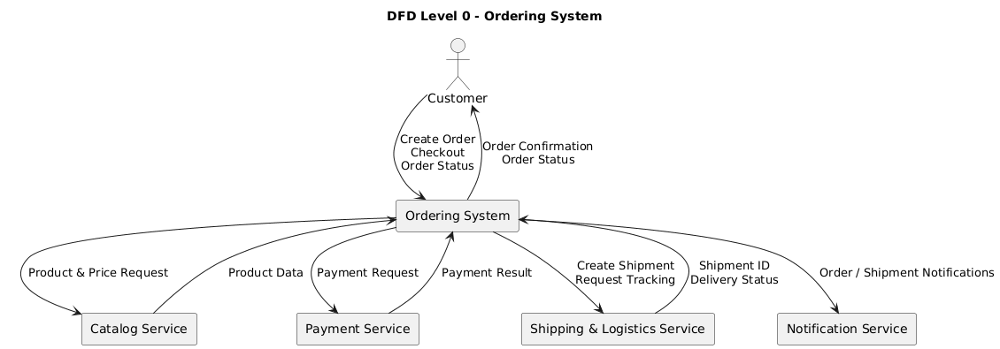
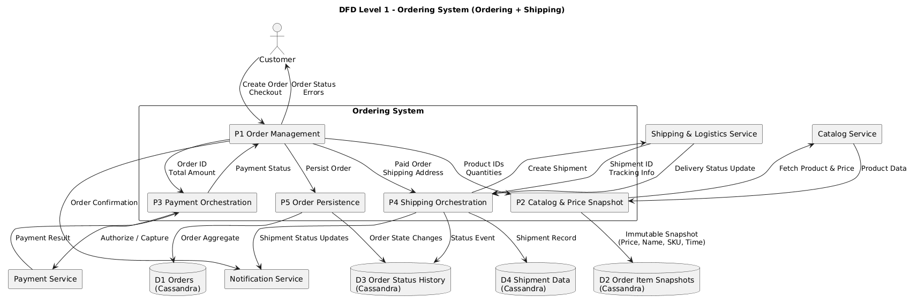

# Ordering sistem analiza

Ordering sistem predstavlja podsistem Temu marketplace platforme koji je zadužen za kreiranje i upravljanje porudžbinama, kontrolu životnog ciklusa porudžbine i orkestraciju sistema procesa plaćanja(payment system) i isporuke(shipping and logistics system). Ovaj sistem mora da garantuje konzistentnost poslovnog toka između kupca, payment sistema i shipping sistema.

Ovaj sistem predstavlja mikroservis baziran na Event-driven arhitekturi, koji je samostalan i sa drugim servisima komunicira putem ashinhrone komunikacije. U potpunosti je stateless i sva stanja se čuvaju u bazi podataka. Sistem može da skalira horizontalno nezavisno od ostalih podsistema. 

## Tech stack

### Backend aplikacija:
Go backend servis koji igra ulogu WEB servera (net/http biblioteka i chi). Autentifikacija se vrši pomoću middleware-a koji se nalazi ispred koda poslovne logike (centralizovani IAM). Takodje u sebi sadrzi implementirane algoritme rate-limiting, request logging, timeout i recovery mehanizme. Rukovanje asinhronim porukama za komunikaciju sa drugim servisima, se takodje vrši u ovom servisu pomoću kafka clienta. Životni ciklus porudžbine je tačno definisan kroz faze.

 Go je izabran zbog visokih performansi, jednostavnog modela konkurentnosti i malog runtime overheada što je pogodno za mikroservisne arhitekture. Bitna uloga ovog sistema je preuzimanje snapshota cena i provera dostupnosti artikala iz korpe pre pokretanja procesa plaćanja. 

Primer životnog ciklusa jednog HTTP zahteva:
```
Client -> API Gateway -> Go HTTP Server -> Middleware (auth, rate limit) -> Router -> Handler -> State Machine -> Cassandra -> Response
```
### Sistem za razmenu poruka
Apache Kafka omogućava asinhronu komunikaciju sa payment i shipping sistemima i razmenu dogadjaja vezanih za stanje porudžbine. Na ovaj način jasno razdvajamo odgovornosti između podsistema. Primjeri događaja su: `PaymentRequested`, `OrderPaid`, `ShippingInitiated`...

Primer toka obrade poruka:
```
Kafka message -> Event deserializer -> Validation -> Idempotency check -> State transition -> Persist
```
Poruke se obradjuju samo jednom.

### Sistem za perzistenciju podataka
Za bazu podataka koristi se Apache Cassandra. Njena uloga je skladištenje porudžbina, metapodataka i stavki. Bitna je i za evidenciju istorije promene stanja porudžbine. Njene karakteristike su da je distribuirana NOSQL baza koja ima visoku dostupnost. Modelovanje podataka radi se na osnovu obrazaca upita.

### Keš memorija
Za privremeno čuvanje podataka potrebnih za Checkout koristi se Redis. Na ovaj način imamo bolje performanse i štitimo sistem od preopterećenja. 
Redis se takodje koristi za deduplication cache, zakljucavanje stanja narudzbe (prevencija paralelnih requestova) i rate limiting.
## DFD




## Security prakse (Iz OWASP Practices for Golang Applications)

### Go

#### Input Validation

Svi ulazni podaci koji dolaze preko HTTP interfejsa prolaze striktne validacione slojeve prije ulaska u poslovnu logiku. U Go aplikaciji se koristi tipizacija jezika kao prva linija odbrane, dok se dodatna validacija (npr. obavezna polja, dozvoljeni opsezi vrijednosti, format adrese, količine artikala) sprovodi korišćenjem validacionih middleware-a. Time se sprječava unošenje nevalidnih ili zlonamjernih podataka u Ordering i Shipping tokove.

#### Sanitization i Output Encoding

Sistem ne vjeruje podacima koji dolaze iz eksternih servisa (Catalog, Payment, Logistics). Svi string podaci koji se vraćaju ka klijentskim aplikacijama (npr. nazivi proizvoda, adrese, statusi pošiljki) prolaze sanitizaciju. Time se eliminišu XSS i injection napadi, iako Go backend ne renderuje HTML direktno.

#### Authentication, Session and Password Management

Autentifikacija je delegirana centralizovanom Identity servisu zasnovanom na OAuth2/OIDC standardima. Ordering i Shipping servisi nikada ne rukuju lozinkama korisnika. Pristup je omogućen isključivo putem kratkotrajnih access tokena, dok se refresh tokeni čuvaju isključivo u Identity domenu. Ovim pristupom se minimizira površina napada i poštuje princip najmanjih privilegija.

Sistem je u potpunosti stateless na backend strani. Sesije se ne čuvaju u memoriji servisa već se korisnički kontekst prenosi kroz JWT tokene. Tokeni imaju ograničen životni vijek, podržavaju rotaciju i vezani su za klijentski kontekst, čime se smanjuje rizik od session hijacking i replay napada.

#### Access Control

Pristup funkcionalnostima Ordering i Shipping sistema zasniva se na RBAC/ABAC modelu. Na nivou API Gateway-a i servisa se eksplicitno provjerava da li korisnik ima pravo da pristupi resursu (npr. samo vlasnik porudžbine može vidjeti njen status, samo sistem može inicirati shipment). Kontrole pristupa su centralizovane i dosljedno primijenjene na svim ulaznim tačkama.

#### Cryptographic Practices

Sistem koristi provjerene kriptografske biblioteke iz standardne Go biblioteke. Svi osjetljivi podaci (tokeni, identifikatori transakcija, reference ka payment sistemu) se čuvaju u šifrovanom obliku ili kao tokenizovane reference. Tajni ključevi i sertifikati se učitavaju iz sigurnih storage-a uz podršku rotacije ključeva.

#### Error Handling and Logging

Greške se obrađuju kontrolisano, pri čemu se krajnjim korisnicima nikada ne izlažu tehnički detalji sistema. Interni logovi sadrže dovoljno informacija za dijagnostiku, ali ne uključuju osjetljive podatke poput PII ili payment informacija. Logovanje je strukturisano i integrisano sa centralnim observability sistemom radi forenzike i audita.

#### Data Protection

Podaci o porudžbinama, adresama isporuke i statusima pošiljki se čuvaju u Cassandra bazi sa jasno definisanim obrascima pristupa. Snapshot mehanizam cijena i kataloga obezbjeđuje da se istorijski podaci ne mijenjaju nakon checkout-a, čime se štiti integritet poslovnih podataka i omogućava auditabilnost.

#### Communication Security

Sva komunikacija između servisa (Ordering, Payment, Shipping) odvija se isključivo preko šifrovanih kanala (TLS). Servisi se međusobno autentifikuju putem sertifikata ili servisnih tokena, čime se sprečava neovlašćeni pristup i man-in-the-middle napadi.

#### System Configuration

Konfiguracija sistema je eksternalizovana i odvojena od koda. Različita okruženja (development, staging, production) imaju strogo razdvojene konfiguracije i tajne. Servisi rade sa minimalnim privilegijama na infrastrukturnom nivou, u skladu sa principom least privilege.


#### Memory Management

Go runtime automatski upravlja memorijom, čime se eliminišu česte klase ranjivosti poput buffer overflow-a i use-after-free grešaka. Posebna pažnja se posvećuje rukovanju osjetljivim podacima u memoriji, koji se ne zadržavaju duže nego što je neophodno.

### Cassandra

#### Authentication (Autentifikacija)

Svaki mikroservis (Ordering, Shipping) koristi poseban database korisnik, čime se eliminiše dijeljenje kredencijala i olakšava audit.

#### Authorization (Access Control)

Pristup podacima se kontroliše pomoću role-based access control (RBAC) mehanizma. Uloge imaju ograničen pristup isključivo onim keyspace-ovima i tabelama koje su neophodne za njihov domen. Na primjer, Shipping servis nema pravo pristupa podacima vezanim za plaćanja ili price snapshot-e, čime se poštuje princip least privilege.

#### Encryption in Transit

Komunikacija između aplikacionih servisa i Cassandra nodova se odvija isključivo preko TLS enkriptovanih kanala. Time se štite podaci u tranzitu od prisluškivanja i manipulacije, posebno u distribuiranim i multi-node klasterima.

#### Encryption at Rest

Osjetljivi podaci se čuvaju u šifrovanom obliku na nivou diska ili keyspace-a. Ovo štiti podatke u slučaju kompromitacije fizičkog diska ili snapshot-a baze.

#### Data Modeling Based on Access Patterns

Cassandra se koristi sa upitno-orijentisanim modeliranjem podataka, gdje su tabele dizajnirane prema tačno definisanim obrascima upita. Time se eliminiše potreba za složenim upitima i smanjuje mogućnost DoS napada kroz skupe i spore upite.

#### Auditing and Logging

Cassandra omogućava audit logove koji bilježe sve pokušaje pristupa, promjene šema i administrativne operacije. Ovi logovi se integrišu sa centralnim sistemom za nadzor radi detekcije sumnjivih aktivnosti i forenzičke analize.

#### Network Segmentation

Cassandra klaster se nalazi u izolovanom mrežnom segmentu, nedostupnom spoljašnjim mrežama. Pristup je dozvoljen isključivo aplikacionim servisima kroz kontrolisane mrežne politike, čime se značajno smanjuje napadna površina.

#### Backup and Snapshot Security

Snapshot-i baze i backup podaci se čuvaju u zaštićenim storage sistemima sa ograničenim pristupom. Snapshot mehanizam se koristi i na aplikacionom nivou (Order price snapshot), čime se dodatno obezbjeđuje integritet istorijskih podataka.

#### Consistency Level and Integrity Protection

Korišćenjem odgovarajućih nivoa konzistentnosti (npr. QUORUM) sistem obezbjeđuje da podaci vezani za porudžbine i statuse isporuke ostanu konzistentni i otporni na parcijalne kvarove ili pokušaje manipulacije.

#### Secure Configuration and Hardening

Podrazumijevane Cassandra postavke se mijenjaju prije produkcije:

- isključuju se nebezbjedni portovi i servisi
- ograničava se JMX pristup
- zabranjuje anonimni pristup

Ovo sprečava poznate klase napada zasnovane na lošoj konfiguraciji.

#### Multi-Tenancy Isolation

Podaci različitih prodavaca i kupaca su logički izolovani kroz particione ključeve. Time se sprječava neovlašćen pristup podacima drugih korisnika čak i u slučaju logičke greške na aplikacionom nivou.

#### Disaster Recovery and Availability

Cassandra klaster je distribuiran i replikovan, čime se obezbjeđuje visoka dostupnost Ordering i Shipping sistema čak i u slučaju gubitka jednog ili više nodova. Ova karakteristika direktno doprinosi sigurnosti sistema u smislu availability (CIA triada).

# Shipping & Logistics sistem i webhook komunikacija

Shipping & Logistics sistem je eksterni podsistem odgovoran za fizičku isporuku porudžbina, praćenje pošiljki i upravljanje statusima isporuke. Ordering sistem sa Shipping podsistemom komunicira asinhrono, putem događaja i webhook mehanizama, čime se izbjegava čvrsta sprega između sistema.

Nakon uspješnog plaćanja, Ordering sistem emituje događaj ShippingInitiated, koji sadrži snapshot relevantnih podataka (artikli, adresa, referenca porudžbine). Shipping sistem preuzima odgovornost za dalji tok isporuke i periodično obavještava Ordering sistem o promjenama stanja pošiljke putem webhook poziva.

### Webhook mehanizam

Webhook predstavlja HTTP callback koji Shipping sistem poziva prema Ordering sistemu kako bi prijavio događaje kao što su:

`ShipmentCreated`
`ShipmentDispatched`
`ShipmentDelivered`
`ShipmentFailed`

Ordering sistem izlaže poseban, strogo ograničen HTTP endpoint za prijem webhook poziva. Ovi endpointi nisu dostupni krajnjim korisnicima i koriste se isključivo za sistemsku komunikaciju.
Sigurnosne mjere webhook komunikacije:
-Autentifikacija webhook poziva se vrši korišćenjem HMAC potpisa ili mTLS-a, čime se garantuje da zahtjev dolazi od ovlašćenog Shipping sistema.

-Replay napadi se sprječavaju korišćenjem timestamp-a i nonce vrijednosti u webhook payload-u.
-Idempotency mehanizam obezbjeđuje da se isti webhook događaj obradi samo jednom, čak i u slučaju ponovnog slanja.
-Validacija payload-a se vrši prije bilo kakve promjene stanja porudžbine.
-Rate limiting i timeout mehanizmi štite Ordering sistem od preopterećenja ili zlonamjernih webhook poziva.

# Dekompozicija Go aplikacije

Go Ordering aplikacija se sastoji od više jasno razdvojenih komponenti, od kojih svaka predstavlja potencijalnu tačku napada.

1. HTTP Server i Router (net/http + chi)

Uloga:

-prijem HTTP zahtjeva
-rutiranje prema odgovarajućim handlerima

2. Middleware sloj (Auth, Rate limiting, Logging)

Uloga:

-autentifikacija i autorizacija
-zaštita od abuse-a
-observability


3. Business Logic / State Machine

Uloga:

-kontrola životnog ciklusa porudžbine
-validacija dozvoljenih tranzicija stanja

4. Kafka Consumer / Producer

Uloga:

-asinhrona komunikacija sa Payment i Shipping sistemima

5. Redis integracija

Uloga:

-checkout cache
-distributed locking
-deduplication

6. Webhook Endpoint (Shipping callbacks)

Uloga:

-prijem statusa isporuke


# Dekompozicija Cassandra baze 

1. CQL Interface

Uloga:

-aplikacioni pristup podacima

2. Data Model, Partitioning i Replication

Uloga:

-raspodjela podataka i performanse
-dostupnost i integritet podataka

3. JMX Interface

Uloga:

-administracija i monitoring
