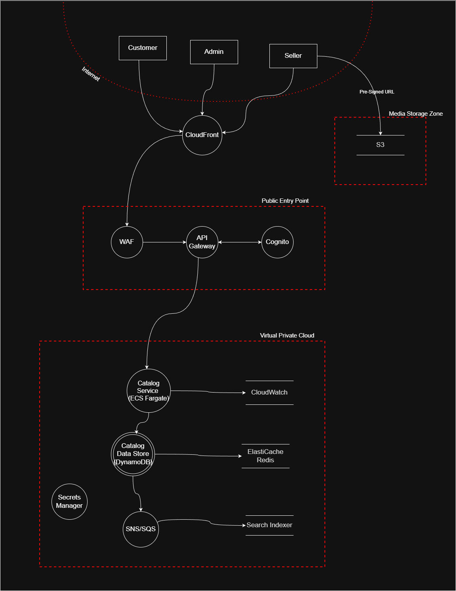

# Product Catalog System – Arhitektura i bezbednosni kontekst

## 1. Pregled sistema

Product Catalog System predstavlja centralni deo marketplace platforme, zadužen za upravljanje proizvodima, ponudama, cenama i pratećim metapodacima. Sistem je projektovan kao **cloud-native, event-driven arhitektura** na AWS platformi, sa jasnim razdvajanjem odgovornosti između slojeva za isporuku sadržaja, bezbednosni perimetar, aplikacionu logiku i skladištenje podataka. Dijagram toka podataka opisanog sistema prestavljen je na sledecoj slici:

## 2. Trust boundary zone

### 2.1 Internet / Untrusted Clients

Ovu zonu čine krajnji korisnici sistema:

* Customer
* Seller
* Admin

Svi zahtevi iz ove zone smatraju se nepoverljivim i podležu validaciji i filtriranju pre nego što im se dozvoli pristup backend resursima.

---

### 2.2 Edge Delivery Layer – [Amazon CloudFront](https://docs.aws.amazon.com/AmazonCloudFront/latest/DeveloperGuide/Introduction.html)

CloudFront se koristi kao **globalni CDN i edge sloj**.

Njegova uloga je:

* distribucija statičkog sadržaja i medija (slike/video proizvoda),
* terminacija TLS konekcija blizu korisnika,
* prosleđivanje dinamičkih API zahteva ka Public Entry Point sloju.

CloudFront ne sprovodi poslovnu logiku niti autentifikaciju, već služi kao **prvi tehnički kontakt sa AWS infrastrukturom**, čime se smanjuje latencija i štiti backend od direktne izloženosti internetu.

---

### 2.3 Public Entry Point (Security & Access Perimeter)

Ova zona predstavlja **prvi bezbednosni sloj sistema** i sadrži sledeće komponente:

#### [AWS WAF](https://docs.aws.amazon.com/waf/latest/developerguide/what-is-aws-waf.html)

AWS WAF obezbeđuje zaštitu od uobičajenih web pretnji, uključujući OWASP Top 10 napade. Njegova uloga je da pre dolaska zahteva do API Gateway-a eliminiše:

* zlonamerne zahteve,
* pokušaje brute-force napada,
* prekomerni saobraćaj (rate limiting).

Na ovaj način se štiti kako aplikacioni sloj, tako i backend infrastruktura.

---

#### [Amazon API Gateway](https://docs.aws.amazon.com/apigateway/latest/developerguide/welcome.html)

API Gateway predstavlja **centralnu ulaznu tačku za sve API zahteve** ka Catalog servisu. On je odgovoran za:

* rutiranje zahteva ka backend servisu,
* primenu throttling i quota pravila,
* integraciju sa autentifikacionim mehanizmima.

API Gateway ne sadrži poslovnu logiku, već služi kao kontrolna i zaštitna veza prema privatnoj mreži.

---

#### [Amazon Cognito](https://docs.aws.amazon.com/cognito/latest/developerguide/what-is-amazon-cognito.html)

Cognito obezbeđuje identitetni sloj sistema i koristi se za:

* autentifikaciju korisnika,
* izdavanje JWT tokena,
* validaciju identiteta putem API Gateway authorizer-a.

Time se obezbeđuje da samo autentifikovani i autorizovani korisnici mogu pristupiti zaštićenim API endpoint-ima.

## 3. Virtual Private Cloud – Private Backend Zone

Backend komponente sistema nalaze se unutar **Virtual Private Cloud (VPC)** i nisu direktno dostupne sa interneta. Ova zona se smatra pouzdanom, ali i dalje podložnom internim bezbednosnim kontrolama.

### 3.1 [Catalog Service – Amazon ECS Fargate](https://docs.aws.amazon.com/AmazonECS/latest/developerguide/AWS_Fargate.html)

Catalog Service je **centralni poslovni servis** sistema, implementiran kao kontejnerska aplikacija pokrenuta na ECS Fargate platformi.

Njegove odgovornosti uključuju:

* upravljanje proizvodima i ponudama,
* sprovođenje poslovnih pravila (validacija cena, statusa, moderacije),
* generisanje pre-signed URL-ova za upload medija,
* emitovanje domen događaja nakon značajnih promena stanja.

Korišćenjem Fargate-a eliminiše se potreba za upravljanjem infrastrukturom, dok se istovremeno zadržava izolacija i skalabilnost servisa.

---

### 3.2 [Catalog Data Store – Amazon DynamoDB](https://docs.aws.amazon.com/amazondynamodb/latest/developerguide/Introduction.html)

Catalog Data Store predstavlja **primarni source of truth** za podatke o proizvodima i ponudama. Kao fizička implementacija koristi se Amazon DynamoDB, koji omogućava:

* nisku latenciju,
* horizontalnu skalabilnost,
* visok stepen dostupnosti.

DynamoDB je posebno pogodan za **read-heavy workload**, pa predstavlja idealno resenje za katalog proizvoda.

---

### 3.3 [ElastiCache Redis](https://docs.aws.amazon.com/AmazonElastiCache/latest/red-ug/WhatIs.html)

Redis se koristi kao **in-memory cache sloj** za ubrzavanje često ponavljanih čitanja iz Product Catalog servisa, kao i za implementaciju pomoćnih bezbednosnih mehanizama poput rate limiting-a. Time se smanjuje opterećenje primarne baze podataka i povećava dostupnost sistema, bez narušavanja konzistentnosti osnovnih poslovnih podataka.

Redis ne predstavlja **source of truth**, već privremeni sloj optimizacije performansi.

---

### 3.4 [SNS / SQS – Event-Driven komunikacija](https://docs.aws.amazon.com/sns/latest/dg/welcome.html)

SNS i SQS omogućavaju asinhronu razmenu događaja između komponenti sistema. Catalog servis emituje domen događaje (npr. *ProductUpdated*, *OfferPublished*), koji se zatim distribuiraju ka potrošačima bez blokiranja glavnog API toka.

Ovaj pristup omogućava:

* *loose-couple* spregu između servisa,
* bolju skalabilnost,
* otpornost na greške.

---

### 3.5 Search Indexer

Search Indexer je pozadinski proces koji konzumira događaje iz SNS/SQS sistema i na osnovu njih ažurira *search index* (npr. OpenSearch). Njegova uloga je da transformiše podatke iz primarnog oblika modela kataloga u oblik pogodan za brzu i efikasnu pretragu.

Na ovaj način se:

* odvaja poslovna logika od pretrage,
* omogućava eventualna konzistentnost,
* postižu visoke performanse prilikom pretrage proizvoda.

---

### 3.6 [AWS Secrets Manager](https://docs.aws.amazon.com/secretsmanager/latest/userguide/intro.html)

Secrets Manager se koristi za bezbedno skladištenje osetljivih podataka, kao što su kredencijali i API ključevi. Time se sprečava hard-kodiranje tajni i omogućava njihova rotacija bez prekida rada sistema.

---

### 3.7 [Amazon CloudWatch](https://docs.aws.amazon.com/AmazonCloudWatch/latest/monitoring/WhatIsCloudWatch.html)

CloudWatch obezbeđuje centralizovan monitoring sistema kroz:

* prikupljanje logova,
* metrike performansi,
* alarme i detekciju anomalija.

Ova komponenta je ključna za neporecivost i incident response.

---

## 4. Media Storage Zone – [Amazon S3](https://docs.aws.amazon.com/AmazonS3/latest/userguide/Welcome.html)

Amazon S3 se koristi za skladištenje slika proizvoda i drugih binarnih objekata. Upload medija se realizuje direktno iz klijentske aplikacije ka S3 putem **vremenski ograničenih pre-signed URL-ova**, koje generiše Catalog Service.

Ovakav pristup:

* eliminiše potrebu da backend obrađuje velike fajlove,
* smanjuje napadnu površinu,
* povećava skalabilnost sistema.
