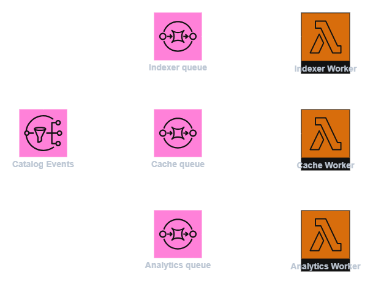

# Asymmetric Cost Exploitation u Catalog Service sistemu

## 1. Uvod

Catalog Service predstavlja centralnu komponentu sistema za upravljanje proizvodima u marketplace okruženju.  
Njegova uloga je da obradi izmene kataloških podataka (npr. promene cena, dostupnosti i metapodataka) i da te izmene propagira ka ostalim delovima sistema, kao što su indeksiranje, keširanje i analitika.

Iako ovakav sistem funkcionalno radi ispravno i poštuje bezbednosna pravila, njegov dizajn može dovesti do specifične klase pretnji koje ne utiču direktno na dostupnost ili integritet, već na **ekonomsku održivost sistema**.  
Jedna od takvih pretnji je **Asymmetric Cost Exploitation**.

Cilj ovog dokumenta je da definiše ovu pretnju u kontekstu konkretnog Catalog Service-a i objasni zašto je postojeći arhitekturalni obrazac posebno podložan njenoj eksploataciji.

---
## 2. Definicija pretnje: Asymmetric Cost Exploitation

U kontekstu Catalog Service-a, **Asymmetric Cost Exploitation** označava situaciju u kojoj:

- akter (npr. seller) izvršava legitimnu i jeftinu operaciju  
- sistem, kao posledicu te operacije, izvršava niz skupih procesa  
- ukupni sistemski trošak višestruko prevazilazi trošak inicijatora  

Ova pretnja ne proizilazi iz greške u autorizaciji ili validaciji podataka, već iz **nepovoljne raspodele troškova u dizajnu sistema**.

---
## 3. Zašto ovo nije klasičan bezbednosni napad

Asymmetric Cost Exploitation se razlikuje od tradicionalnih bezbednosnih napada jer:

- sve akcije prolaze postojeće autorizacione mehanizme
- sistem ne detektuje anomalije u ponašanju
- nema očiglednih simptoma poput pada sistema ili grešaka

Drugim rečima, sistem funkcioniše „normalno“, ali postaje izložen **finansijskom iscrpljivanju**.  
Zbog toga se ova pretnja ne može adekvatno analizirati isključivo kroz standardne bezbednosne modele, već zahteva **ekonomski pristup threat-modelingu**.

---
## 4. Generički obrazac eksploatacije u Catalog Service-u

Na apstraktnom nivou, pretnja se manifestuje kroz sledeći obrazac:


Legitimna izmena kataloških podataka dovodi do generisanja događaja koji se dalje propagira ka više potrošača.  
Svaki potrošač predstavlja dodatni side-effect i dodatni trošak.

---
## 5. Početna arhitektura Catalog Service-a

U početnoj verziji sistema, Catalog Service koristi fan-out mehanizam kako bi jedan događaj distribuirao ka više nezavisnih potrošača:



Ovakav dizajn omogućava jasnu separaciju odgovornosti, ali istovremeno uvodi **multiplikaciju troška**.  
Svaka pojedinačna izmena ili kreiranje novog proizvoda rezultuje:

- višestrukim porukama  
- višestrukim izvršavanjima worker-a  
- dodatnim logovanjem i metrikama  

Trošak sistema direktno zavisi od broja potrošača, a ne od poslovne vrednosti izmene.

---
## 6. Zašto je ovakav dizajn ranjiv

Problem ne leži u fan-out mehanizmu samom po sebi, već u činjenici da:

- svaka izmena proizvoda ima isti tretman  
- ne postoji diferencijacija između „značajne“ i „trivijalne“ izmene  
- trošak obrade nije ograničen u odnosu na aktera koji je inicirao izmenu  

Na ovaj način, autorizovani akter može, bez kršenja pravila, da inicira veliki broj skupih operacija u sistemu.

---
## 7. Mitigacija pretnje Asymmetric Cost Exploitation

U cilju smanjenja izloženosti pretnji Asymmetric Cost Exploitation u okviru Catalog Service-a, razmatrane su dve arhitekturalne strategije mitigacije. Prva predstavlja **inicijalnu optimizaciju postojećeg rešenja**, dok druga uvodi **suštinsku promenu u načinu obrade događaja** i predstavlja stvarnu, dugoročnu mitigaciju.

---
### 7.1 Inicijalna mitigacija: SNS FIFO sa deduplikacijom događaja

Kao prvi korak ka smanjenju fan-out efekta, uveden je **SNS FIFO topic** za kataloške događaje, sa uključenom **content-based deduplication** funkcionalnošću.

Deduplikacija predstavlja mehanizam kojim sistem automatski prepoznaje i odbacuje **identične događaje** koji se pojave unutar definisanog vremenskog prozora. Ukoliko se isti događaj pošalje više puta (sa istim sadržajem poruke), SNS će zadržati samo jednu instancu i sprečiti njenu dalju propagaciju ka potrošačima. Na primer, sledeća poruka će biti prihvaćena samo jednom, čak i ako se pošalje više puta:

```json
{
  "sellerId": "s1",
  "productId": "p1",
  "update": { 
    "price": 123.44, 
  }
}
```

Ovaj pristup efikasno eliminiše ponavljanje identičnih događaja, trivijalne retry obrasce i neefikasno slanje istih poruka.

Međutim, deduplikacija **ne rešava suštinski problem** Asymmetric Cost Exploitation-a. U realnim scenarijima, sadržaj poruke se često menja pri svakoj izmeni, čak i kada je ta promena semantički beznačajna. Sledeća poruka, iako gotovo identična prethodnoj, biće tretirana kao novi događaj i prosleđena svim potrošačima:

```json
{
  "sellerId": "s1",
  "productId": "p1",
  "update": { 
    "price": 123.45
  }
}
```

Zbog toga se SNS FIFO sa deduplikacijom može posmatrati kao **optimizacija postojećeg dizajna**, ali ne i kao kompletna mitigacija pretnje.

---
### 7.2 Prava mitigacija: agregacija ažuriranja pre fan-out distribucije

Suštinska mitigacija Asymmetric Cost Exploitation zahteva promenu **tačke u kojoj se fan-out primenjuje**.  
Umesto da se svaki pojedinačni update proizvoda odmah distribuira ka svim potrošačima, uvodi se **agregacioni sloj** koji prikuplja i objedinuje izmene tokom definisanog vremenskog prozora.

Na slici ispod prikazana je mitigovana arhitektura Catalog Service-a, u kojoj se događaji prvo agregiraju, a tek potom distribuiraju ka downstream potrošačima.


U ovom modelu:

- svaki događaj se obrađuje od strane **Aggregator** komponente  
- čuva se samo poslednje stanje po entitetu (npr. proizvodu)  
- fan-out se primenjuje nad **agregiranim događajima**, a ne nad pojedinačnim izmenama  

Agregacija se realizuje korišćenjem **DynamoDB** kao laganog i visoko skalabilnog skladišta, dok **Lambda** funkcije služe kao jeftin mehanizam za obradu visokofrekventnih događaja.

---
### 7.3 Ekonomski efekat agregacije

Na prvi pogled, mitigovana arhitektura deluje složenije, jer uvodi dodatne komponente (Aggregator, DynamoDB, Flusher).  
Međutim, iz perspektive cloud troškova, ovakav sistem je **značajno jeftiniji** od naivnog fan-out pristupa.

Razlog za to je činjenica da:

- pokretanje Lambda funkcije predstavlja niskotroškovnu operaciju  
- upis i čitanje iz DynamoDB-a ima zanemarljiv trošak po zahtevu  
- agregacija drastično smanjuje broj događaja koji ulaze u fan-out fazu  
- fan-out distribucija ostaje najskuplja operacija i izvršava se ređe  

Drugim rečima, sistem koristi **jeftine operacije za apsorbovanje velikog broja događaja**, a skupe operacije aktivira samo kada je to neophodno.

Važno je napomenuti da ovakav pristup uvodi **eventual consistency** u sistem, jer se propagacija izmena ka potrošačima ne dešava trenutno, već nakon isteka agregacionog vremenskog prozora. U kontekstu catalog service-a, ovo malo kašnjenje ne predstavlja problem.

---
### 7.4 Promena ekonomske strukture sistema

Uvođenjem agregacije, trošak obrade više nije linearno vezan za broj izvršenih izmena, već za:

- broj različitih entiteta koji su izmenjeni  
- dužinu agregacionog vremenskog prozora  

Time se eliminiše osnovni uslov za Asymmetric Cost Exploitation, jer sistem više ne dozvoljava da se mala i jeftina akcija pretvori u lanac skupih side-effect operacija.

---
### 7.5 Zaključak o mitigaciji

SNS FIFO sa deduplikacijom predstavlja koristan, ali ograničen prvi korak u optimizaciji sistema.  
Prava mitigacija Asymmetric Cost Exploitation u Catalog Service-u postiže se tek uvođenjem **agregacije događaja pre fan-out distribucije**, čime se sistem čini ne samo otpornijim, već i dugoročno ekonomski održivim.

---
## 8. Zaključak

U kontekstu Catalog Service-a, Asymmetric Cost Exploitation predstavlja realističnu i često zanemarenu pretnju koja ne ugrožava funkcionalnost sistema, ali direktno utiče na njegovu ekonomsku održivost.

Razumevanje ove pretnje i njeno adresiranje kroz arhitekturalne odluke predstavlja ključni korak ka dizajnu sistema koji je ne samo funkcionalno ispravan, već i **ekonomski bezbedan**.
