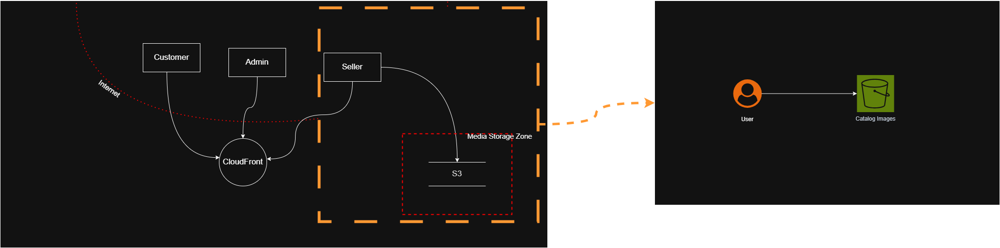
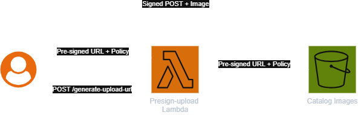

## 1. Uvod

S3 bucket predstavlja skladišni sloj sistema zadužen za čuvanje slika proizvoda (Catalog Images).  
Upload slika je funkcionalno neophodan deo poslovne logike, jer prodavci moraju imati mogućnost postavljanja i ažuriranja multimedijalnog sadržaja.

Iako Amazon S3 obezbeđuje snažne mehanizme kontrole pristupa, bezbednost skladišnog sloja zavisi od pravilne konfiguracije IAM politika i bucket policy-ja.

Jedna od čestih grešaka u AWS okruženju jeste omogućavanje public read ili public write pristupa nad S3 bucket-ima, čime se gubi kontrola nad infrastrukturnim resursima.

## 2. Definisanje pretnje i napada

### 2.1 Pretnja

**Pretnja:**

> Neautorizovan ili nekontrolisan pristup skladišnim resursima sistema.

Ova pretnja može dovesti do:

* kompromitovanja integriteta podataka
* prepisivanja postojećih objekata
* postavljanja malicioznog sadržaja
* brisanja resursa
* reputacionog i pravnog rizika

Pretnja ne mora biti posledica ranjivosti aplikacionog koda, već pogrešne infrastrukturne konfiguracije.

### 2.2 Napad

**Napad:** Direct Bucket Write

> Direct Bucket Write predstavlja napad u kome napadač direktno uploaduje objekte u S3 bucket bez prolaska kroz aplikacioni kontrolni sloj.

Napad eksploatiše:

* preširoka IAM prava
* pogrešno konfigurisane bucket policy-je
* public write pristup
* nedostatak autentifikacije prilikom generisanja upload dozvola

Napad ne zahteva kompromitaciju aplikacije, već iskorišćava pogrešnu arhitektonsku postavku skladišnog sloja.

## 3. Naivna arhitektura skladišnog sloja

Naivna ili ranjiva implementacija upload procesa predstavljena je na sledećoj slici:

U ovom modelu:

* korisnik direktno komunicira sa upload servisom
* kontrola pristupa nije strogo vezana za identitet korisnika
* ili bucket dozvoljava preširok write pristup

U ekstremnom slučaju, S3 bucket može imati public write pristup, što omogućava napadaču da direktno šalje zahteve ka skladišnom resursu.

U takvoj arhitekturi izostaje jasna kontrolna tačka između klijenta i infrastrukture.

### 3.1 Arhitektonska neefikasnost: propagacija binarnog sadržaja kroz aplikacioni sloj

Pored rizika direktnog write pristupa, česta arhitektonska greška jeste propagacija binarnog sadržaja (slika) kroz ceo aplikacioni sloj, analogno obradi JSON podataka.

U takvom modelu:

* klijent šalje sliku backend servisu
* backend obrađuje i prosleđuje sadržaj dalje
* slika prolazi kroz više servisa ili mrežnih slojeva

Ovakav pristup:

* povećava potrošnju memorije i CPU resursa
* povećava mrežni saobraćaj
* uvodi dodatne tačke zagušenja
* generiše nepotrebne operativne troškove

Binarnim objektima (poput slika) ne pripada isti tretman kao strukturiranim JSON podacima.  
Njihova priroda zahteva direktan i kontrolisan pristup skladišnom sloju, bez prolaska kroz čitav sistem.

Pre-signed URL mehanizam ne samo da rešava bezbednosnu pretnju, već i eliminiše ovu arhitektonsku neefikasnost.

## 4. Identifikovana ranjivost

Ranjivost se može definisati kao:

> Izostanak centralizovane i vremenski ograničene kontrole pristupa skladišnom resursu.

Ako klijent ima:

* direktan pristup bucket-u  
* dugotrajne ili statične kredencijale  
* ili široka write prava  

sistem gubi kontrolu nad:

* tipom fajla
* veličinom objekta
* strukturom ključa (key)
* vremenskim trajanjem dozvole

Time skladišni sloj postaje potencijalni ulazni vektor napada.

## 5. Mitigacija napada

### 5.1 Pre-Signed URL mehanizam

Mitigovana arhitektura uvodi kontrolisano delegiranje pristupa putem pre-signed URL mehanizma:

Umesto direktnog write pristupa:

1. Autentifikovani korisnik zahteva upload dozvolu od backend servisa.
2. Backend generiše pre-signed URL koristeći sopstvene IAM privilegije.
3. URL sadrži:
   * vremensko ograničenje (expiration)
   * definisan key objekta
   * ograničenje veličine fajla
   * ograničenje Content-Type-a
4. Klijent uploaduje objekat direktno u S3 koristeći potpisani URL.
5. Nakon isteka vremena, URL postaje nevažeći.

Bucket ostaje u režimu `private` pristupa.

### 5.2 Bezbednosne karakteristike

Pre-signed URL obezbeđuje:

* Delegiranje minimalnih privilegija
* Vremenski ograničen pristup
* Kriptografski potpisane uslove (HMAC)
* Neizlaganje AWS kredencijala klijentu
* Centralizovanu kontrolu generisanja upload dozvola

Bilo kakva izmena:

* vremena isteka
* key vrednosti
* veličine fajla
* Content-Type-a

dovodi do nevažećeg potpisa i odbijanja zahteva od strane S3 servisa.

## 6. Efekat mitigacije

Primena pre-signed URL mehanizma:

* eliminiše mogućnost Direct Bucket Write napada
* uklanja public write pristup
* uvodi vremenski ograničeno delegiranje prava
* smanjuje površinu napada
* zadržava princip najmanjih privilegija (least privilege)

S3 bucket više ne predstavlja javno izloženi infrastrukturni resurs, već kontrolisani skladišni sloj dostupan isključivo putem potpisanih i vremenski ograničenih zahteva.

## 7. Zaključak

Direct Bucket Write napad predstavlja tipičan primer infrastrukturne ranjivosti u cloud sistemima, posebno u AWS okruženju gde su pogrešne bucket policy konfiguracije čest uzrok bezbednosnih incidenata.

Primena pre-signed URL mehanizma uvodi kontrolisano delegiranje pristupa, zadržava privatnost skladišnog sloja i eliminiše osnovni vektor napada.

Na taj način skladišni sloj ostaje pod potpunom kontrolom sistema i integritet objekata je očuvan.

