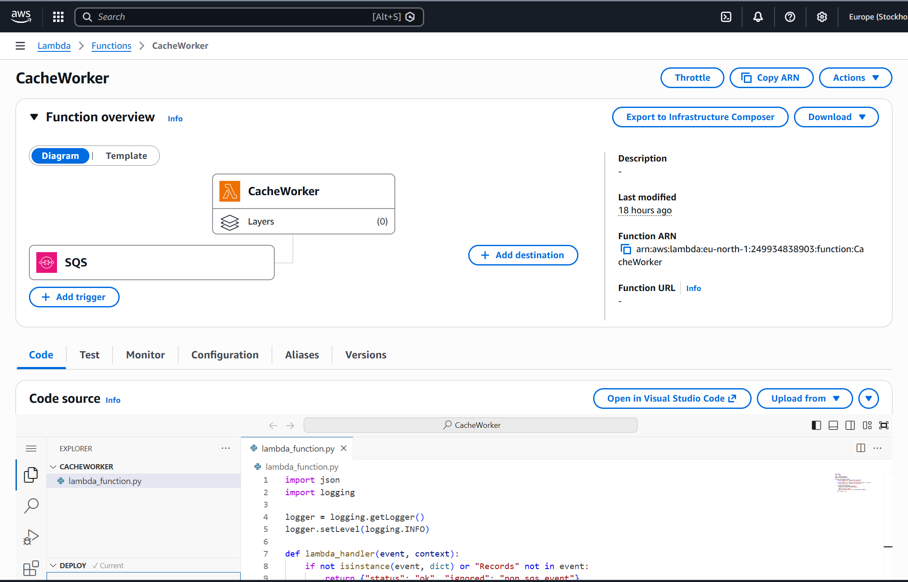
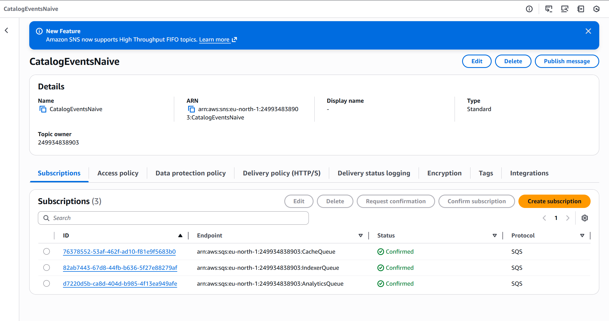
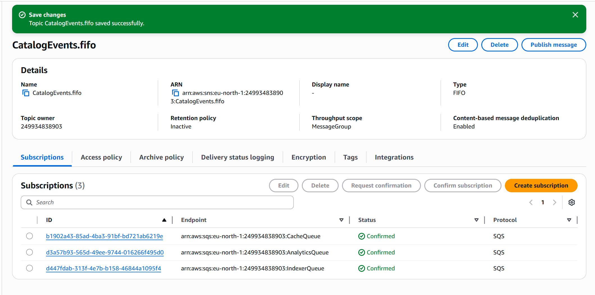
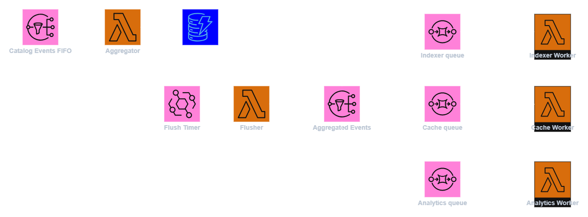

> **Napomena 1:**  
> U svim eksperimentima korišćen je isti identitet prodavca `sellerId = s1` i proizvod `productId = p1`.  
> Razlika između zahteva bila je isključivo u polju `update` (npr. promena `price`, `title` ili njihove kombinacije).  

> **Napomena 2 (Implementaciona pojednostavljenja):**  
> Radi jednostavnosti demonstracije, svaka Worker Lambda funkcija:
> - trigerruje se isključivo putem svog odgovarajućeg SQS queue-a,
> - nema poslovnu logiku,
> - u logovima samo prikazuje sadržaj poruke koju je primila.  
>
> Na taj način, broj invokacija direktno predstavlja meru troška fan-out mehanizma.

# Worker Lambda implementacija

Svaka Worker Lambda (Cache, Indexer, Analytics) implementirana je identično:

```python
import json
import logging

logger = logging.getLogger()
logger.setLevel(logging.INFO)

def lambda_handler(event, context):
    if not isinstance(event, dict) or "Records" not in event:
        return {"status": "ok", "ignored": "non_sqs_event"}

    if not event["Records"] or event["Records"][0].get("eventSource") != "aws:sqs":
        return {"status": "ok", "ignored": "not_sqs_source"}

    for record in event["Records"]:
        sns_envelope = json.loads(record["body"])
        message = json.loads(sns_envelope["Message"])

        logger.info("Received JSON:\n%s", json.dumps(message, indent=2))

    return {"status": "ok"}
````

Na sledećoj slici prikazan je primer `CacheWorker` Lambda funkcije sa SQS trigger-om:



# 1. Naivni Fan-Out pristup

## Arhitektura


U ovom modelu `CatalogEvents SNS` salje event do svih subscribe-ovanih SQS redova, koji dalje pozivaju korespodentne lambda funkcije.

> Jedan publish generiše tri Lambda invokacije.

## SNS konfiguracija



Vidljivo je:

- Tip: Standard
- Tri aktivne SQS pretplate
- Svaka pretplata aktivira svoju Lambda funkciju
- Ne postoji nikakav mehanizam deduplikacije.

## Log demonstracija (Naivni pristup)

Poslato je više payload-ova u kratkom vremenskom periodu.

Primer uzastopnih logova:

```text
START RequestId: 929bb36a...
Received JSON:
{
  "sellerId": "s1",
  "productId": "p1",
  "update": {
    "price": 123.45
  }
}

START RequestId: 3ef33b7c...
Received JSON:
{
  "sellerId": "s1",
  "productId": "p1",
  "update": {
    "price": 123.45
  }
}

START RequestId: cb118918...
Received JSON:
{
  "sellerId": "s1",
  "productId": "p1",
  "update": {
    "price": 123.44
  }
}

START RequestId: 9574f55e...
Received JSON:
{
  "sellerId": "s1",
  "productId": "p1",
  "update": {
    "price": 123.44
  }
}
```

Ukupno: 11 poruka → 11 invokacija po workeru.

### Rezultat

| Worker          | Invocations |
| --------------- | ----------- |
| CacheWorker     | 11          |
| IndexerWorker   | 11          |
| AnalyticsWorker | 11          |
| TOTAL           | 33          |

# 2. SNS FIFO + Content-Based Deduplication

## SNS FIFO konfiguracija



Za razliku od prethodnog servisa, CatalogEvents.fifo koristi FIFO pristup sa ukljucenom content-based deduplikacijom
## Bitna karakteristika

- SNS koristi hash message body-a
- Deduplikacioni prozor traje **5 minuta**
- Trajanje prozora **nije moguće menjati**

## Log demonstracija (FIFO)

Primeri primljenih poruka:

```text
Received JSON:
{
  "sellerId": "s1",
  "productId": "p1",
  "update": { "price": 123.45 }
}

Received JSON:
{
  "sellerId": "s1",
  "productId": "p1",
  "update": { "price": 123.44 }
}

Received JSON:
{
  "sellerId": "s1",
  "productId": "p1",
  "update": { "price": 123 }
}

Received JSON:
{
  "sellerId": "s1",
  "productId": "p1",
  "update": { "price": 12.45 }
}
```

Uočeno:

- Minimalna promena vrednosti (`123.45 → 123.44`) tretira se kao nova poruka.
- Identična poruka unutar 5 minuta ne stiže do worker-a.
- Nakon isteka 5 minuta, ista poruka (`price: 123.45`) ponovo prolazi.

### Rezultat

|Worker|Invocations|
|---|---|
|CacheWorker|6|
|IndexerWorker|6|
|AnalyticsWorker|6|

Ukupno: **18 invokacija**

> FIFO smanjuje trošak, ali ga ne eliminiše kod varijacija payload-a.

# 3. Agregacija (Digest pristup)

## Arhitektura sa agregacijom



Dodate komponente:

- Aggregator Lambda - Svaki zahtev koji prodje SNS FIFO biva smesten u DynamoDB privremenu bazu radi agregacije podataka
- DynamoDB tabela
- Flush Timer (5 minuta) - Nakon isteka timer-a, Flusher lambda sakuplja sve nove promene i prosledjuje ih dalje na obradu
- Flusher Lambda

## Rezultat agregacije

Od 11 zahteva:

- U agregator je dospelo 4
- Promene su objedinjene u jedan zapis
- Ka worker-ima je poslat samo jedan agregirani događaj

Primer:

```json
{
  "sellerId": "s1",
  "productId": "p1",
  "update": {
    "title": "New title",
    "price": 123.45
  }
}
```

### Invokacije

| Worker          | Invocations |
| --------------- | ----------- |
| CacheWorker     | 1           |
| IndexerWorker   | 1           |
| AnalyticsWorker | 1           |
| Aggregator      | 4           |

Ukupno: **9 invokacija**

---

# 4. Poređenje potrošnje

## Tabelarni prikaz

| Worker           | Naive | FIFO | Digest |
| ---------------- | ----- | ---- | ------ |
| AnalyticsWorker  | 11    | 6    | 1      |
| CacheWorker      | 11    | 6    | 1      |
| IndexerWorker    | 11    | 6    | 1      |
| Aggregator       | 0     | 0    | 4      |
| CatalogEventsSNS | 11    | 11   | 11     |

---

## Ukupan broj Lambda invokacija

|Scenario|Total|
|---|---|
|Naive|33|
|FIFO|18|
|Digest|9|

---

## Vizuelni prikaz

```
Naive   : █████████████████████████████ (33)
FIFO    : ████████████████              (18)
Digest  : ████████                      (9)
```
