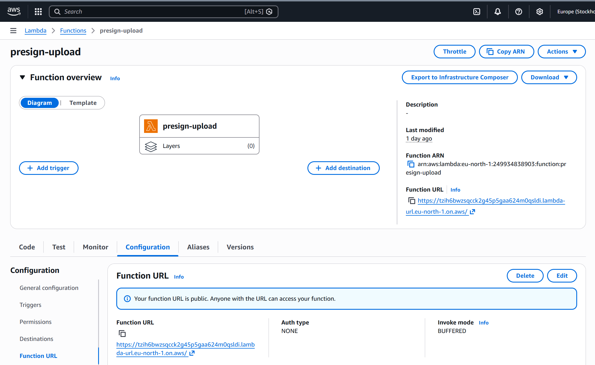
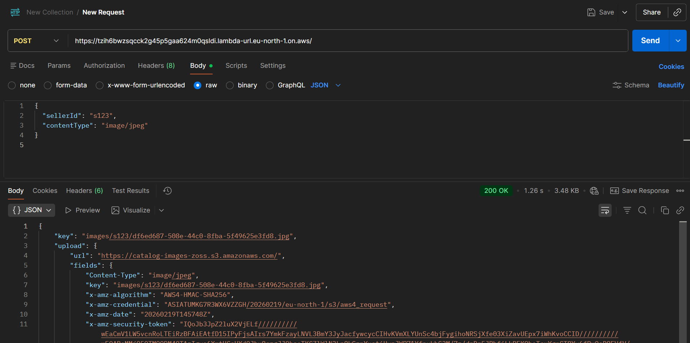
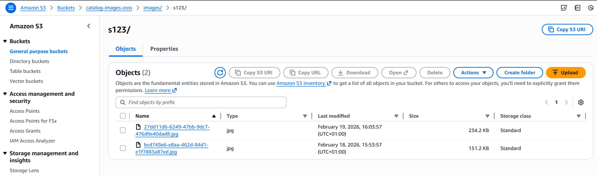
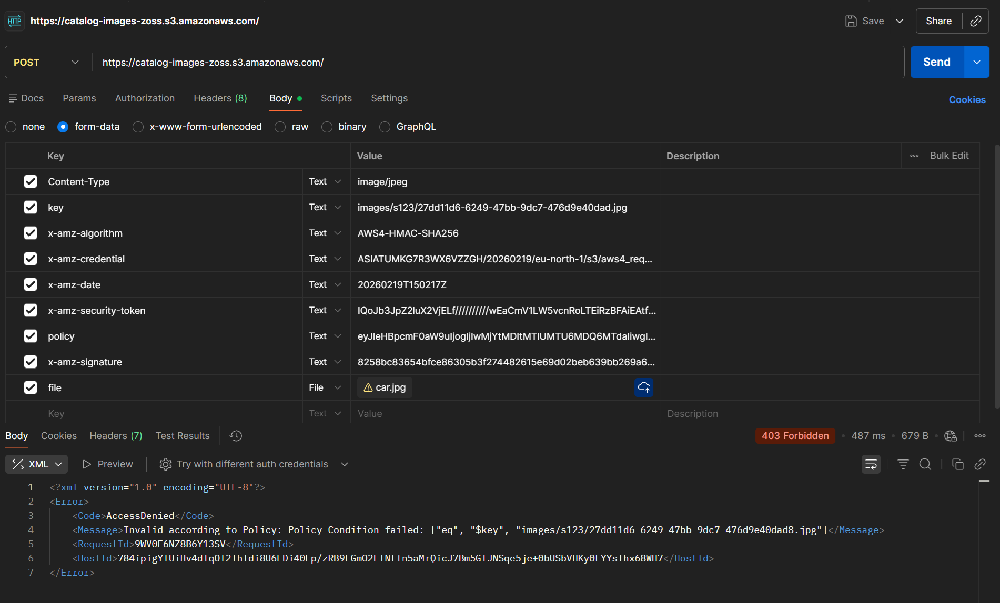
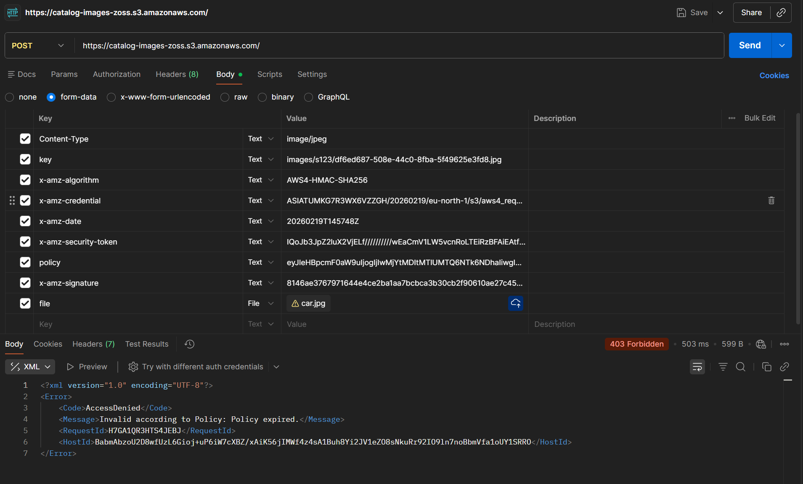

## 1. Amazon S3 – skladišni sloj sistema

Slike proizvoda se skladište u S3 bucket-u `catalog-images-zoss`

Na slici je prikazan pregled bucket-a u okviru AWS naloga.


Bucket se nalazi u regionu `eu-north-1` i koristi se isključivo za čuvanje slika proizvoda.  
Upload se ne vrši direktno putem javnog write pristupa, već preko pre-signed POST mehanizma koji generiše backend.

## 2. AWS Lambda – generisanje pre-signed POST zahteva

### 2.1. Pregled Lambda funkcija

Upload token generiše posebna Lambda funkcija `presign-upload`.
Na sledećoj slici prikazan je AWS Lambda panel sa listom funkcija sistema.


Funkcija `presign-upload` je odgovorna za generisanje pre-signed POST parametara.

### 2.2. Function URL endpoint

Lambda funkcija izlaže javni endpoint putem **Function URL** mehanizma.



Function URL:

```
https://tzih6bwzsqcck2g45p5gaa624m0qsldi.lambda-url.eu-north-1.on.aws/
```

Frontend klijent poziva ovaj endpoint kako bi dobio parametre potrebne za upload u S3.

### 2.3. Implementacija funkcije

```python
import json, os, uuid
import boto3
from datetime import datetime

s3 = boto3.client("s3")
BUCKET = os.environ["BUCKET_NAME"]
MAX_SIZE = int(os.environ.get("MAX_SIZE_BYTES", "5242880"))  # 5MB

def lambda_handler(event, context):
    body = json.loads(event.get("body") or "{}")
    seller_id = body.get("sellerId", "unknown")
    content_type = body.get("contentType", "image/jpeg")

    ext = "jpg"
    if content_type == "image/png":
        ext = "png"
    elif content_type == "image/webp":
        ext = "webp"

    key = f"images/{seller_id}/{uuid.uuid4()}.{ext}"

    conditions = [
        ["starts-with", "$Content-Type", "image/"],
        ["content-length-range", 1, MAX_SIZE],
        {"key": key},
        {"bucket": BUCKET},
    ]

    fields = {
        "Content-Type": content_type,
    }

    presigned = s3.generate_presigned_post(
        Bucket=BUCKET,
        Key=key,
        Fields=fields,
        Conditions=conditions,
        ExpiresIn=120
    )

    return {
        "statusCode": 200,
        "headers": {"Content-Type": "application/json"},
        "body": json.dumps({
            "key": key,
            "upload": presigned
        })
    }
```

#### Ključni elementi implementacije

- Generisanje jedinstvenog `key`-a po seller-u
- Ograničenje veličine fajla (MAX_SIZE)
- Dozvoljeni samo `image/*` tipovi
- Vremenski ograničena validnost (120 sekundi)
- Tačno definisan bucket i key

S3 će odbiti svaki upload koji ne zadovoljava navedene uslove.

## 3. Interakcija putem Postman-a

### 3.1. Poziv Lambda funkcije



Request body:

```json
{
  "sellerId": "s123",
  "contentType": "image/jpeg"
}
```

Response (`200 OK`):

```json
{
  "key": "images/s123/df6ed687-508e-44c0-8fba-5f49625e3fd8.jpg",
  "upload": {
    "url": "https://catalog-images-zoss.s3.amazonaws.com/",
    "fields": {
      "Content-Type": "image/jpeg",
      "key": "images/s123/df6ed687-508e-44c0-8fba-5f49625e3fd8.jpg",
      "x-amz-algorithm": "AWS4-HMAC-SHA256",
      "x-amz-credential": "...",
      "x-amz-date": "...",
      "x-amz-security-token": "...",
      "policy": "...",
      "x-amz-signature": "..."
    }
  }
}
```

### 3.2. Upload fajla u S3

Nakon dobijanja parametara, vrši se `POST` ka endpoint-u naseg s3 bucket-a:

```
https://catalog-images-zoss.s3.amazonaws.com/
```

Telo zahteva predstavljeno je putem `form-data`, gde svi parametri (`Content-Type`, `key`, `x-amz-*`, `policy`, `x-amz-signature`) moraju biti identični vrednostima dobijenim u polju `upload.fields`. Pored njih, neophodno je dodati i samu sliku putem vrednosti pod `file` kljucem.

![[postman0.png]]

## 4. Verifikacija uspešnog upload-a

Nakon uspešnog zahteva dobija se prazan response sa kodom `204`, a objekat postaje vidljiv u S3 konzoli.



Na slici je vidljiv prefiks `images/s123/` i generisani UUID fajlovi.

## 5. Error scenariji

### 5.1. Policy Condition Failed



XML odgovor:

```xml
<Error>
  <Code>AccessDenied</Code>
  <Message>
    Invalid according to Policy: Policy Condition failed
  </Message>
</Error>
```

**Uzrok**: key u zahtevu ne odgovara key-u generisanom od strane Lambda funkcije.

### 5.2. Policy Expired



XML odgovor:

```xml
<Error>
  <Code>AccessDenied</Code>
  <Message>Invalid according to Policy: Policy expired.</Message>
</Error>
```

**Uzrok**: istekao pre-signed token (`ExpiresIn=120`).
