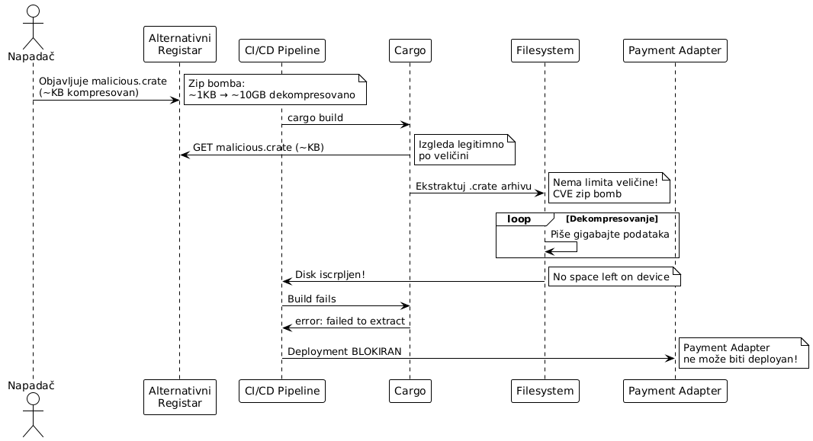

# Zip Bomb Disk Exhaustion napad na Cargo komponenti

###### Teodor Vidaković, R213/2025

---

## 1. Uvod

Cargo je zvanični upravljač zavisnostima i build sistem za Rust projekte. Odgovoran je za preuzimanje, verifikaciju i ekstrakciju zavisnosti iz registra (crates.io i alternativni registri) tokom `cargo build` i `cargo update` operacija u Payment Adapter CI/CD pipeline-u.

**Ranjivost**: **CVE-2022-36114** (CVSS 4.2). Cargo ne ograničava količinu podataka koji se ekstraktuju iz kompresovanih arhiva (`.crate` fajlova, koji su u `tar.gz` formatu). Napadač koji može objaviti paket na alternativni registar može kreirati specijalno formatiranu arhivu, tzv. **zip bombu** koja pri ekstrakciji se proširi u višestruko više podataka nego što je njena kompresovana veličina, iscrpljujući disk prostor ciljne mašine. 

**Kontekst**: Payment Adapter CI/CD pipeline koristi `cargo build` za kompajliranje projekta. Napadač koji kompromituje alternativni registar ili MITM između Cargo-a i registra može podmetnuti maliciozni paket koji uzrokuje disk exhaustion na build serveru, blokirajući sve buduće deploy-e adaptera.

**Važna napomena**: crates.io implementirao je server-side provjere koje odbijaju ovakve pakete, pa ranjivost afektuje isključivo korisnike **alternativnih registara**. 

**Životni ciklus napada**:
```
Napadač objavljuje zip bombu na alternativni registar
→ CI/CD: cargo build → Cargo preuzima .crate arhivu (~KB)
→ Cargo ekstraktuje bez limita → gigabajti podataka
→ Disk iscrpljen → build fails → Payment Adapter deployment blokiran
```



Ovaj dokument opisuje ranjivost nekontrolisane ekstrakcije u Cargo upravljaču zavisnostima, demonstrira tok zip bomb napada u kontekstu Payment Adapter-a, i prikazuje mitigaciju update-om na Rust 1.64+.

---

## 2. Definicija pretnje

### 2.1 STRIDE klasifikacija

| STRIDE kategorija | Primjenljivost | Obrazloženje |
|---|---|---|
| **Denial of Service** | Da | Disk exhaustion blokira `cargo build` operacije. Payment Adapter se ne može kompajlirati ni deployati. |
| **Tampering** | Da | Napadač podmećuje maliciozni paket u alternativni registar. Zavisnosti su kompromitovane. |
| **Elevation of Privilege** | Ne | Napad ne eskalira privilegije direktno. |
| **Information Disclosure** | Ne | Zip bomb ne otkriva podatke. |
| **Spoofing** | Da | Maliciozni paket se pojavljuje kao legitimna zavisnost sa validnim imenom i verzijom. |
| **Repudiation** | Da | Greška `No space left on device` ne otkriva koji paket je uzrok, forenzika otežana. |

### 2.2 CWE referenca

- **CWE-400: Uncontrolled Resource Consumption** - Cargo ne limitira disk prostor korišten pri ekstrakciji arhiva.
- **CWE-405: Asymmetric Resource Consumption (Amplification)** - mala ulazna arhiva (~KB) uzrokuje veliku izlaznu količinu podataka (~GB).
- **CWE-610: Externally Controlled Reference to a Resource** - Cargo vjeruje sadržaju paketa iz alternativnog registra bez provjere ekstrakcione veličine.

### 2.3 Opis pretnje

`.crate` fajlovi su `tar.gz` arhive. Kada Cargo preuzme zavisnost, dekompresuje i ekstraktuje sadržaj u `~/.cargo/registry/src/`. Zip bomba eksploatiše visoki kompresioni odnos, npr. fajl pun nula (`/dev/zero`) kompresuje se na minimalnu veličinu, ali pri ekstrakciji zauzima pun originalni prostor.

Cargo u verzijama prije Rust 1.64 ne implementira nikakav limit na:
- ukupnu veličinu ekstraktovanih podataka
- broj fajlova u arhivi
- dubinu direktorijumske strukture

Napadač može kreirati `.crate` arhivu veličine samo nekoliko KB koja pri ekstrakciji generiše **10+ GB** podataka, punjenjem diska do kapaciteta.

**Asimetrija napada** - to je ono što ga čini opasnim:
```
Napadačev trud: kreiranje ~1 KB arhive
Žrtvina šteta: 10+ GB disk exhaustion, blokiran CI/CD pipeline
Omjer amplifikacije: > 10,000:1
```


---

## 3. Afektovani resursi

### 3.1 CI/CD Build server — DOSTUPNOST

Primarni afektovani resurs. Disk exhaustion uzrokuje:
- `cargo build` → `error: No space left on device (os error 28)`
- Svi naredni build-ovi blokirani dok se disk ne oslobodi
- Docker layer cache koruptovan - rebuild od nule potreban
- Logovi se ne mogu upisivati - monitoring slijep

**CIA**: Dostupnost build infrastrukture kompromitovana.

### 3.2 Payment Adapter deployment - DOSTUPNOST

Sekundarni resurs. Blokiran build direktno znači:
- Novi deploy-i Payment Adapter-a su nemogući
- Hotfix za kritičan bug ne može biti isporučen
- SLA prema Stripe partneru narušen - payment downtime

### 3.3 Ostale zavisnosti na build serveru - INTEGRITET

Disk exhaustion može koruptovati fajlove koji su bili u procesu pisanja u trenutku popunjavanja diska - lock fajlovi, djelimično napisane binarne datoteke, konfiguracije.

### 3.4 Docker image registar - DOSTUPNOST

Ako build server dijeli disk sa Docker registrom, Payment Adapter Docker image se ne može pushati - produkcijski deployment potpuno blokiran.

---

## 4. Model napada

### 4.1 Akter napada

**Napadač sa mogućnošću objavljivanja paketa na alternativni registar** koji Payment Adapter CI/CD koristi kao izvor zavisnosti. U enterprise okruženjima, alternativni registri (Artifactory, Nexus, Gitea) su česta praksa za vendoring internih paketa.

Napadač može biti:
- Insider sa pristupom internom registru
- Napadač koji kompromitovao CI/CD servis account
- MITM između Cargo-a i alternativnog registra

### 4.2 Preduslovi

- Cargo verzija < 1.64 (Rust < 1.64) na build mašini
- Payment Adapter koristi alternativni registar (`[source.*]` u `.cargo/config.toml`)
- Napadač može objaviti paket na taj registar
- Build server nema disk quota ograničenje za Cargo cache

### 4.3 Tok napada

1. Napadač kreira zip bombu:
dd if=/dev/zero bs=1M count=1024 | gzip > bomb.tar.gz
(1 GB nula, kompresovano u ~1 MB)
↓

2. Pakuje kao validnu .crate arhivu sa Cargo.toml i src/lib.rs
↓

3. Objavljuje na alternativni registar kao "payment-utils v1.0.1"
↓

4. Payment Adapter Cargo.toml: payment-utils = "1.0.1"
↓

5. CI/CD: cargo build
→ Cargo preuzima "payment-utils-1.0.1.crate" (~1 MB)
→ Cargo ekstraktuje u ~/.cargo/registry/src/ (BEZ LIMITA)
→ 1+ GB podataka eksplodira na disku
↓

6. Disk pun → error: No space left on device (os error 28)
↓

7. Build server neupotrebljiv → Payment Adapter deployment DOWN


---

## 5. Ranjiva arhitektura

### Ranjivi kod 

Problem: unpack_in() ekstraktuje fajlove u petlji bez praćenja ukupne ekstraktovane veličine. Svaki fajl u arhivi se ekstraktuje bez ograničenja.

## 6. Mitigacija
Primarna mitigacija: Update na Rust 1.64+
