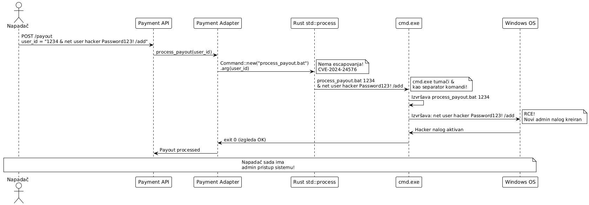

Command Injection napad na Rust standardnu biblioteku

###### Teodor Vidaković, R213/2025

---

## 1. Uvod

`std::process::Command` je dio Rust standardne biblioteke koji omogućava pokretanje eksternih procesa. API dokumentacija eksplicitno garantuje da se proslijeđeni argumenti prosljeđuju procesu **kao što jesu**, bez evaluacije od strane shell-a. To znači da je sigurno proslijediti nepouzdane korisničke unose kao argumente. Payment Adapter koristi ovu komponentu za pokretanje batch skripti pri procesiranju Windows-based Stripe payout operacija i integracionih workflow-ova.

**Ranjivost**: **CVE-2024-24576** (CVSS **10.0 CRITICAL**). Rust standardna biblioteka u verzijama `< 1.77.2` ne provodi ispravno escaping argumenata pri pozivanju Windows batch fajlova (`.bat`, `.cmd` ekstenzije) putem `Command` API-ja. Napadač koji može kontrolisati argumente proslijeđene batch fajlu može ubaciti proizvoljne shell komande **Remote Code Execution**.

**Kontekst**: Payment Adapter na Windows build serveru koristi `Command::new("process_payout.bat").arg(user_id)` za procesiranje Stripe payout zahtjeva. Napadač koji kontroliše `user_id` polje može injektovati shell komande koje `cmd.exe` izvršava sa privilegijama Payment Adapter procesa.

**Životni ciklus napada**
```
Napadač šalje: user_id = "1234 & net user hacker Password123! /add"
→ Payment Adapter: Command::new("process_payout.bat").arg(user_id)
→ std ne escapuje ispravno → cmd.exe vidi: process_payout.bat 1234 & net user ...
→ cmd.exe izvršava obje komande → RCE
```




Ovaj dokument opisuje command injection ranjivost u Rust standardnoj biblioteci, demonstrira mehanizam nedovoljnog escapinga pri pozivu Windows batch fajlova, i prikazuje mitigaciju update-om na Rust `1.77.2+`.

---

## 2. Definicija pretnje

### 2.1 STRIDE klasifikacija

| STRIDE kategorija | Primjenljivost | Obrazloženje |
|---|---|---|
| **Elevation of Privilege** | Da | Injektovane komande se izvršavaju sa privilegijama Rust procesa. Napadač može eskalirati na SYSTEM nivo ako Payment Adapter radi sa visokim privilegijama. |
| **Tampering** | Da | RCE dozvoljava modifikaciju fajlova, konfiguracija, baze podataka i kriptografskih ključeva na build serveru. |
| **Information Disclosure** | Da | Napadač može pročitati Stripe API ključeve, payment card podatke i environment varijable. |
| **Denial of Service** | Da | Injektovane komande mogu terminirati servis, obrisati fajlove ili koruptovati bazu. |
| **Spoofing** | Da | Sa privilegijama procesa, napadač može lažno predstavljati Payment Adapter prema Stripe API-ju. |
| **Repudiation** | Da | Komande izvršene kroz batch file izgledaju kao legitimne operacije u Windows Event Log-u. |

### 2.2 CWE referenca

- **CWE-78: Improper Neutralization of Special Elements used in an OS Command (OS Command Injection)** - nepotpun escaping dozvoljava injektovanje shell metacharacter-a koje `cmd.exe` interpretira kao nove komande.
- **CWE-116: Improper Encoding or Escaping of Output** - Rust `Command` API implementira escaping koji nije dovoljan za sve `cmd.exe` edge case-ove.
- **CWE-20: Improper Input Validation** - API ne validira da proslijeđeni argumenti ne sadrže shell metacharacter-e.

### 2.3 Opis pretnje

Rust `Command::arg()` i `Command::args()` API dokumentacija garantuje da argumenti **neće biti evaluirani od strane shell-a**. Na Linux/macOS, ova garancija vrijedi jer se `execve()` sistemski poziv koristi direktno. Na Windows-u, situacija je kompleksnija:

1. Windows `CreateProcess()` API prima sve argumente kao **jedinstven string**, a ne listu argumenata
2. Svaki program sam rastavlja taj string na individualne argumente
3. Većina programa koristi standardni C runtime (`MSVCRT`) za rastavljanje - konzistentan i predvidljiv
4. **`cmd.exe`** (korišten za batch fajlove) ima **vlastitu logiku rastavljanja argumenata** sa drugačijim pravilima escapinga i specijalnim karakterima

Rust standardna biblioteka implementira vlastiti escaping za batch fajlove, ali ta implementacija nije pokrila sve `cmd.exe` edge case-ove. Specijalni karakteri poput `&`, `|`, `>`, `<`, `^` i kombinacije navodnika i razmaka mogu "pobjeći" iz konteksta argumenta i biti interpretirani kao shell operatori. [web:268]

**Efekat**: Napadač može terminirati jedan argument i injektovati nove `cmd.exe` komande koristeći nepokrivene escape sekvence.

---

## 3. Afektovani resursi

### 3.1 Payment Adapter proces - INTEGRITET / DOSTUPNOST

Primarni afektovani resurs. RCE sa privilegijama Payment Adapter procesa dozvoljava:
- Čitanje i modifikaciju Stripe API ključeva iz environment varijabli
- Brisanje ili korupciju payment transakcija u bazi
- Instaliranje backdoor-a za perzistentni pristup
- Terminiranje procesa - payment processing down

**CIA**: Sva tri elementa CIA trijaде kompromitovana.

### 3.2 Windows build server - ELEVATION OF PRIVILEGE

Sekundarni resurs. Ako Payment Adapter radi sa administratorskim privilegijama:
- `net user` → kreiranje novih korisničkih naloga
- `reg add` → modifikacija registry-ja
- `sc create` → instaliranje malicioznih Windows servisa
- Potencijalni SYSTEM level pristup

### 3.3 Stripe API ključevi - POVJERLJIVOST

Injektovana komanda može pročitati environment varijable (`set STRIPE_SECRET_KEY`) i eksfiltrirati API ključeve prema napadačevom serveru.

### 3.4 PCI DSS usaglašenost

RCE na Payment Adapter-u direktno narušava PCI DSS Requirement 6.4 (zaštita javno dostupnih web aplikacija) i Requirement 2.2 (konfiguracija sistema). Kompromitovani sistem zahtijeva forenzičku istragu i potencijalno obustavljanje card processing aktivnosti.

---

## 4. Model napada

### 4.1 Akter napada

**Napadač koji može kontrolisati argumente proslijeđene batch fajlu**:
- Korisnik koji podnosi Stripe payout zahtjev sa malicioznim `user_id` poljem
- MITM koji mijenja payment webhook payload
- Insider koji modifikuje API zahtjev

### 4.2 Preduslovi

- Rust `< 1.77.2` na Windows build serveru
- Payment Adapter poziva `.bat` ili `.cmd` fajl sa korisničkim ulazom kao argumentom
- `std::process::Command` se koristi bez dodatnog sanitiziranja argumenata

### 4.3 Tok napada

1. Napadač identifikuje endpoint koji prosljeđuje user input kao batch arg
↓

2. Kreira payload:
user_id = "valid_id"&whoami>C:\output.txt&echo ""
↓

3. Payment Adapter: Command::new("payout.bat").arg(&user_id).output()
↓

4. Rust < 1.77.2: escaping ne pokrije edge case → cmd.exe vidi:
payout.bat "valid_id" & whoami > C:\output.txt & echo ""
↓

5. cmd.exe izvrsava: payout.bat, zatim whoami, zatim echo
↓

6. whoami output: NT AUTHORITY\SYSTEM (RCE potvrđen!)

## 5. Ranjiva arhitektura

Problemi:

1. cmd.exe interpretira & kao operator ulančavanja komandi - nije escapovan

2. | (pipe), > (redirect), < (input redirect) nisu escapovani

3. ^ (cmd.exe escape karakter) nije konzistentno handlovan

4. Kombinacije " + & mogu "pobjeći" iz navodničkog konteksta


## 5. Mitigacija

Primarna mitigacija: Update na Rust 1.77.2+