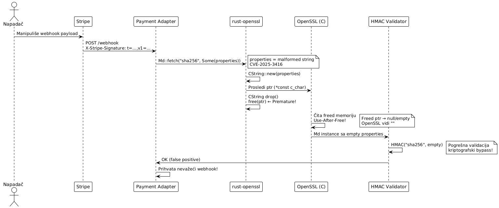

# Use-After-Free napad na `rust-openssl` biblioteku

###### Teodor Vidaković, R213/2025

---

## 1. Uvod

`rust-openssl` je Rust FFI binding za OpenSSL kriptografsku biblioteku, korišten u Payment Adapter-u za HMAC webhook verifikaciju, TLS konekcije i kriptografske operacije sa Stripe API-jem. Kao zavisnost, dostupna je u obliku dvije biblioteke: `openssl` i `openssl-sys`.

**Ranjivost**: **RUSTSEC-2025-0022 / CVE-2025-3416** (CVSS 3.7). Funkcije `Md::fetch()` i `Cipher::fetch()` primaju `properties` argument tipa `CString`. Rust `CString` se dealocira (drop) odmah po konverziji u raw pointer, ali OpenSSL C biblioteka zadržava referencu na tu memoriju. Pristup oslobođenoj memoriji (UAF) uzrokuje da OpenSSL parsira `properties` kao prazan string, ignorirajući stvarne kriptografske parametre.

**Kontekst**: Payment Adapter koristi `Md::fetch()` za SHA-256 HMAC verifikaciju Stripe webhook potpisa. Napadač koji može kontrolisati `properties` argument (npr. kroz malformed webhook header) može uzrokovati da HMAC provjera tiho prihvati pogrešne kriptografske parametre.

**Životni ciklus napada**:
```
Stripe webhook → Payment Adapter: Md::fetch("sha256", Some(properties))
→ CString drop → UAF → OpenSSL čita prazan string
→ HMAC("empty_properties") → pogrešna kriptografska validacija
```



Ovaj dokument opisuje UAF ranjivost u `rust-openssl` FFI bindingu, demonstrira mehanizam memorijske korupcije u kriptografskom kontekstu, i prikazuje mitigaciju update-om na patched verziju.

---

## 2. Definicija pretnje

### 2.1 STRIDE klasifikacija

| STRIDE kategorija | Primjenljivost | Obrazloženje |
|---|---|---|
| **Tampering** | Da | UAF uzrokuje da OpenSSL ignoriše stvarne crypto parametre. Kriptografska operacija se izvršava sa pogrešnim konfiguracionim postavkama. |
| **Spoofing** | Da | Napadač može kreirati webhook payload koji prolazi HMAC verifikaciju jer UAF mijenja ponašanje hash funkcije. |
| **Elevation of Privilege** | Da | Zaobilaženjem kriptografske verifikacije, napadač može izvršiti neovlaštene finansijske operacije (lažni `payment_intent.succeeded` eventi). |
| **Information Disclosure** | Da | UAF čitanje iz oslobođene memorije može izložiti sadržaj heap-a koji je prethodno bio na toj adresi. |
| **Denial of Service** | Da | Nedefinisano ponašanje (UB) uzrokovano UAF-om može uzrokovati crash procesa. |
| **Repudiation** | Da | Lažni Stripe event se loguje kao legitiman jer je verifikacija prošla. Forenzika ne može razlikovati napad od legitimnog poziva. |

### 2.2 CWE referenca

- **CWE-416: Use After Free** - `CString` se dealocira dok OpenSSL C biblioteka još uvijek drži pokazivač na tu memoriju.
- **CWE-672: Operation on a Resource after Expiration or Release** - Rust binding ne garantuje životni vijek `CString`-a dovoljno dugo za OpenSSL operacije.
- **CWE-347: Improper Verification of Cryptographic Signature** - Indirektni efekat: HMAC verifikacija se izvršava sa krivim parametrima usljed UAF-a.

### 2.3 Opis pretnje

Rust garantuje memorijsku sigurnost unutar safe koda, ali FFI granica (Foreign Function Interface) prema C bibliotekama nije pokrivena Rust borrow checker-om. U `rust-openssl < 0.10.72`, sljedeći tok uzrokuje UAF:

1. Rust kreira CString za properties argument

2. CString konvertuje u *const c_char (raw pointer)

3. Rust drop() oslobađa CString (Rust smatra posao završenim)

4. OpenSSL C funkcija prima raw pointer

5. OpenSSL čita iz već oslobođene memorije → UAF

6. Oslobođena memorija sadrži null bajt → OpenSSL parsira prazan string

7. Kriptografska funkcija se poziva bez specificiranih properties


**Efekat**: `Md::fetch(None)` i `Md::fetch(Some("..."))` daju identičan rezultat, jer UAF uzrokuje da `Some(properties)` bude tretiran kao `None`. U Payment Adapter kontekstu, ovo znači da eksplicitno konfigurisani HMAC parametri bivaju tiho ignorirani.

---

## 3. Afektovani resursi

### 3.1 Kriptografski integritet — INTEGRITET

Primarni afektovani resurs. UAF mijenja ponašanje kriptografskih operacija:

- **HMAC verifikacija** - `Md::fetch("sha256", Some(properties))` se ponaša kao `Md::fetch("sha256", None)`, ignorišući eksplicitne provider parametre.
- **Webhook validacija** - Stripe webhook HMAC potpis može biti prihvaćen ili odbijen na osnovu UAF artefakta u memoriji, a ne stvarnog sadržaja.
- **TLS konekcije** - `Cipher::fetch()` sa krivim properties može odabrati neodgovarajući cipher suite.

**CIA**: Integritet kriptografskih operacija kompromitovan.

### 3.2 Payment transakcije - INTEGRITET

Sekundarni resurs. Ako HMAC verifikacija prihvati lažni `payment_intent.succeeded` Stripe event:

- Iznos se markira kao plaćen bez stvarne transakcije.
- Automatski refund procesi se ne pokreću ispravno.
- PCI DSS usaglašenost je narušena.

**Poslovni uticaj**: Direktan finansijski gubitak.

### 3.3 Audit logovi - NEPORICANJE

Lažni payment event se loguje sa validnim HMAC potpisom (UAF uzrokuje da verifikacija prođe), te forenzika ne može razlikovati legitiman od lažnog event-a.

### 3.4 Heap memorija - POVJERLJIVOST

UAF čitanje iz oslobođene heap memorije može izložiti prethodni sadržaj: kriptografske ključeve, session token-e ili payment card metadata koji su bili na toj heap adresi.

---

## 4. Model napada

### 4.1 Akter napada

**Napadač sa mogućnošću slanja HTTP zahtjeva na Payment Adapter webhook endpoint**. Napadač ne mora poznavati Stripe webhook secret. UAF uzrokuje da verifikacija prihvati netačne parametre.

### 4.2 Preduslovi

- `rust-openssl < 0.10.72` kao zavisnost projekta
- Payment Adapter koristi `Md::fetch()` ili `Cipher::fetch()` sa `properties` argumentom
- Napadač može slati HTTP zahtjeve na webhook endpoint

### 4.3 Tok napada

1. Napadač kreira lažni Stripe webhook payload
↓

2. Šalje na Payment Adapter endpoint sa malformed properties
↓

3. Adapter poziva: Md::fetch("sha256", Some(malformed_properties))
↓

4. CString za malformed_properties se dealocira pri prelasku FFI granice
↓

5. OpenSSL čita iz oslobođene memorije → prazni string
↓

6. HMAC se izračunava sa krivim parametrima
↓

7. Verifikacija prolazi → lažni payment_intent.succeeded procesiran


---

## 5. Ranjiva arhitektura

### Ranjivi kod — `rust-openssl/src/md.rs`

```rust
// rust-openssl v0.10.71 — ranjivo
pub fn fetch(
    ctx: Option<&OpenSslRef>,
    algorithm: &str,
    properties: Option<&str>,
) -> Result<Md, ErrorStack> {
    let algorithm = CString::new(algorithm).unwrap();

    // RANJIVO: CString se kreira, konvertuje i ODMAH dealocira
    // OpenSSL dobija raw pointer na vec oslobođenu memoriju!
    let properties = properties
        .map(|s| CString::new(s).unwrap());

    unsafe {
        ffi::EVP_MD_fetch(
            ctx.map_or(ptr::null_mut(), OpenSslRef::as_ptr),
            algorithm.as_ptr(),
            // properties.as_ref() vraca Option<&CString>
            // .map(CString::as_ptr) vraca raw pointer
            // CString se drop-uje na kraju ovog izraza!
            properties.as_ref().map_or(ptr::null(), CString::as_ptr),
        )
    }
    // properties CString se ovde dealocira (drop)
    // ali OpenSSL C funkcija je vec primila pokazivac na tu memoriju!
}
```

## 6. Mitigacija

Update na patched verziju:
```
[dependencies]
openssl     = "0.10.72"   # SAFE: ispravno upravljanje CString životnim vijekom
openssl-sys = "0.9.107"   # SAFE
```

```bash
cargo update -p openssl
cargo update -p openssl-sys
```