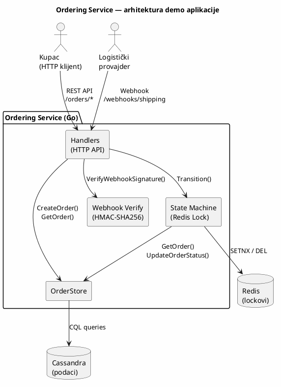

# KT3 — Bezbjednosna analiza Ordering i Shipping & Logistics podsistema

###### Danilo Cvijetić R225/2025

---

## Pregled

Ovaj direktorijum sadrži bezbjednosnu analizu i demonstraciju dva napada na Temu marketplace platformu:

| # | Podsistem | Napad | Folder |
|---|-----------|-------|--------|
| 1 | **Ordering** | Race Condition na State Machine (non-owner-aware Redis lock) | [`ordering/`](ordering/) |
| 2 | **Shipping & Logistics** | Webhook Signature Bypass (JSON canonicalization flaw) | [`shipping/`](shipping/) |

Zajednička demo aplikacija se nalazi u [`demo/`](demo/) folderu.

---

## Arhitektura demo aplikacije

Demo aplikacija je Go servis koji implementira Ordering state machine sa Redis distribuiranim lock-om i Shipping webhook endpoint-om sa HMAC verifikacijom. Koristi Cassandru za perzistenciju i Redis za distribuirano zaključavanje.



### Pokretanje

```bash
cd demo
docker compose up --build -d
```

Servis je dostupan na `http://localhost:8080`.

### API endpointi

| Metod | Endpoint | Opis |
|-------|----------|------|
| `POST` | `/orders` | Kreiranje porudžbine |
| `GET` | `/orders/{orderID}` | Pregled porudžbine |
| `POST` | `/orders/{orderID}/pay` | Plaćanje (PENDING_PAYMENT → PAID) |
| `POST` | `/orders/{orderID}/cancel` | Otkazivanje (PENDING_PAYMENT → CANCELLED) |
| `POST` | `/orders/{orderID}/ship` | Iniciranje slanja (PAID → SHIPPING) |
| `GET` | `/orders/{orderID}/history` | Istorija statusa |
| `POST` | `/webhooks/shipping` | Webhook za status pošiljke |
| `GET` | `/health` | Health check |

---

## Napad 1: Race Condition na Ordering State Machine

**Folder**: [`ordering/`](ordering/)

**Ranjivost**: Non-owner-aware Redis lock koristi statičku vrijednost i bezuslovnu `DEL` operaciju. Kada lock TTL istekne tokom obrade, drugi klijent preuzima lock, a originalni klijent briše tuđi lock pozivom `DEL`, omogućavajući paralelne tranzicije stanja.

**Demonstracija**:
```bash
cd ordering
chmod +x attack.sh
./attack.sh http://localhost:8080 20
```

**Mitigacija**: Owner-aware lock sa UUID vrijednošću i Lua skriptom za atomski release. Detalji u [`ordering/README.md`](ordering/README.md).

---

## Napad 2: Webhook Signature Bypass na Shipping podsistem

**Folder**: [`shipping/`](shipping/)

**Ranjivost**: Webhook HMAC verifikacija koristi JSON deserializaciju u struct koji ne sadrži `status` polje, pa re-serializacija proizvodi kanonički JSON bez tog polja. HMAC se izračunava nad nepotpunim podacima, omogućavajući napadaču da promijeni `status` (npr. iz `IN_TRANSIT` u `LOST`) bez invalidacije potpisa, čime pokreće neovlašteni refund.

**Demonstracija**:
```bash
cd shipping
chmod +x attack.sh
./attack.sh http://localhost:8080
```

**Mitigacija**: Raw-byte HMAC verifikacija nad kompletnim payload-om + konstantno-vremensko poređenje. Detalji u [`shipping/README.md`](shipping/README.md).

---

## Ostali napadi na Ordering podsistem

U nastavku su teorijski opisani ostali napadi koji se mogu izvršiti na Ordering podsistem, zajedno sa odgovarajućim mitigacijama.

### 1. Price Manipulation — TOCTOU (Time-of-Check Time-of-Use)

**Pretnja**: Napadač manipuliše cijenama artikala između trenutka kada su cijene prikazane u korpi i trenutka kada se kreira porudžbina.

**CWE referenca**: CWE-367 (Time-of-Check Time-of-Use Race Condition)

**STRIDE**: Tampering, Elevation of Privilege

**Akter napada**: Kompromitovani prodavac (seller) sa pristupom Catalog servisu, ili insider threat sa write pristupom na Catalog API/bazu.

**Preduslovi**:
- Ordering servis dohvata aktuelne cijene iz Catalog servisa u realnom vremenu prilikom checkout-a (nema lokalni snapshot cijena)
- Napadač ima mogućnost izmjene cijena artikala u Catalog servisu (seller portal, kompromitovan API ključ, ili direktan pristup bazi)
- Ne postoji mehanizam za poređenje prikazane cijene sa checkout cijenom (price deviation check)
- Vremenski prozor između prikaza cijene u korpi i izvršenja checkout-a je dovoljno velik (tipično 1–30 sekundi) da napadač može izvršiti izmjenu
- Catalog servis nema rate limiting ili audit trail na promjene cijena koji bi detektovao brze oscilacije

**Tok napada**:
1. Kupac (ili napadačev saučesnik) dodaje artikal u korpu — Catalog servis vraća cijenu od 100 EUR
2. Frontend prikazuje artikal po cijeni od 100 EUR u korpi
3. Napadač (kompromitovani prodavac) mijenja cijenu artikla na 1 EUR putem Catalog API-ja
4. Kupac klikne "Checkout" — Ordering servis šalje `GET /catalog/products/{id}/price` ka Catalog servisu
5. Catalog servis vraća novu cijenu od 1 EUR
6. Ordering servis kreira porudžbinu sa cijenom od 1 EUR — kupac plaća 99 EUR manje
7. Napadač vraća cijenu na 100 EUR — sljedeći kupci vide normalnu cijenu

**Afektovani resursi**: Ordering podaci (integritet), Payment transakcije (integritet). Finansijski gubitak za prodavce ili platformu.

**Mitigacija**:
- **Price Snapshot pri checkout-u** — Ordering servis kreira immutable snapshot cijena u trenutku checkout-a (tabela `order_item_snapshots`). Sve dalje operacije koriste snapshot cijene, ne aktuelne.
- **Price deviation check** — Ako se cijena promijenila za više od konfigurisanog praga (npr. 5%) između prikaza i checkout-a, sistem traži ponovnu potvrdu od kupca.
- **Write-once semantika** — Snapshot je immutable nakon kreiranja; naknadne izmjene cijena u katalogu ne utiču na već kreirane porudžbine.
- **Audit trail na Catalog servisu** — Logovanje svih promjena cijena sa timestamp-om, seller ID-em i IP adresom. Detekcija brzih oscilacija cijena (npr. promjena > 50% u roku od 1 minute) sa automatskim alertom.

---

### 2. Kafka Event Replay / Injection

**Pretnja**: Napadač ponovo šalje `PaymentSucceeded` Kafka event za istu porudžbinu, pokušavajući da dobije dupli fulfillment (dva puta isporuku za jedno plaćanje).

**CWE referenca**: CWE-294 (Authentication Bypass by Capture-replay), CWE-345 (Insufficient Verification of Data Authenticity)

**STRIDE**: Tampering, Spoofing, Elevation of Privilege

**Akter napada**: Insider threat sa pristupom internoj mreži (DevOps, SRE, kompromitovani zaposleni), ili eksterni napadač koji je ostvario pristup Kafka klasteru putem kompromitovanih kredencijala ili mrežnog pivotiranja.

**Preduslovi**:
- Napadač ima mrežni pristup Kafka klasteru (broker-i su dostupni sa napadačeve pozicije — ista mreža, VPN, ili kompromitovan bastion host)
- Kafka klaster nema konfigurisane ACL-ove (Access Control Lists) ili su postavljeni previše permisivno — napadač može slati poruke na `payment.events` topic
- Kafka eventi nemaju kriptografski potpis (HMAC ili digitalni potpis) koji bi omogućio verifikaciju pošiljaoca
- Ordering servis ne implementira idempotency provjeru (deduplication) za `event_id` polje Kafka evenata
- Napadač može presresti ili pročitati postojeće Kafka evente (npr. putem `kafka-console-consumer`, kompromitovanog monitoring alata poput Kafka UI, ili log aggregation sistema)
- TLS između Kafka brokera i klijenata nije konfigurisan ili su certifikati kompromitovani

**Tok napada**:
1. Kupac kreira porudžbinu i izvrši plaćanje — Payment servis salje `PaymentSucceeded` event na Kafka topic `payment.events`
2. Ordering servis konzumira event, izvršava tranziciju `PENDING_PAYMENT → PAID`, i pokreće shipping proces
3. Napadač presretne originalni `PaymentSucceeded` event (koristeći `kafka-console-consumer --topic payment.events --from-beginning` ili sličan alat)
4. Napadač ponovo salje isti event na `payment.events` topic koristeći `kafka-console-producer` ili Kafka client biblioteku
5. Ordering servis prima duplirani event — bez idempotency provjere, ponovo pokreće shipping proces
6. Rezultat: dva fulfillment procesa za jedno plaćanje — dupla pošiljka, finansijski gubitak

**Afektovani resursi**: Ordering podaci (integritet — dupli fulfillment), Shipment Data (integritet — kreirana dupla pošiljka), Payment podaci (integritet — jedna uplata, dva slanja).

**Mitigacija**:
- **Idempotency check** — Svaki Kafka event nosi jedinstveni `event_id`. Ordering servis čuva `event_id` u Redis deduplication cache-u (`SET dedup:{event_id} 1 NX EX 3600`). Ako event sa istim ID-em stigne ponovo, preskače se.
- **State machine zaštita** — State machine ne dozvoljava tranziciju `PAID → PAID`, pa čak i ako deduplication promaši, tranzicija se odbija.
- **Kafka ACL** — Ograničiti ko može pisati na payment topic-e. Samo Payment servis smije slati `PaymentSucceeded` evente. Konfiguracija: `kafka-acls --add --allow-principal User:payment-service --producer --topic payment.events`.
- **Event potpis** — Payment servis potpisuje svaki event HMAC-om. Ordering servis verifikuje potpis prije obrade.
- **mTLS između Kafka klijenata i brokera** — Obostrana TLS autentifikacija sprečava neautorizovane klijente da se povežu na klaster.

---

### 3. IDOR (Insecure Direct Object Reference) na porudžbinama

**Pretnja**: Napadač pristupa ili modifikuje porudžbine drugih korisnika pogađanjem ili enumeracijom `order_id` vrijednosti.

**CWE referenca**: CWE-639 (Authorization Bypass Through User-Controlled Key), CWE-284 (Improper Access Control)

**STRIDE**: Information Disclosure, Tampering

**Akter napada**: Autentifikovani korisnik platforme (kupac sa validnim nalogom i JWT tokenom) koji pokušava pristupiti resursima drugih korisnika.

**Preduslovi**:
- Ordering servis ne implementira ownership provjeru — handler ne provjerava da li `order.customer_id` odgovara `authenticated_user_id` iz JWT tokena
- Napadač posjeduje validan korisnički nalog i može generisati autentifikovane HTTP zahtjeve (Bearer token)
- `order_id` koristi predvidljiv format (sekvencijalni integer, kratki alfanumerički string) koji omogućava enumeraciju, ILI napadač je na drugi način saznao tuđi `order_id` (npr. putem referral linka, customer support interakcije, ili URL-a dijeljenog na društvenim mrežama)
- API Gateway ili middleware sloj ne implementira dodatnu autorizaciju na nivou resursa (oslanja se isključivo na autentifikaciju)
- Ne postoji rate limiting na `GET /orders/{orderID}` endpointu koji bi ograničio masovnu enumeraciju

**Tok napada**:
1. Napadač se autentifikuje sa svojim korisničkim nalogom i dobija JWT token
2. Napadač šalje `GET /orders/{orderID}` sa inkrementiranim ili nasumičnim `order_id` vrijednostima
3. Za svaki validan `order_id`, servis vraća kompletne podatke o porudžbini: ime kupca, adresu isporuke, stavke, iznos, status plaćanja
4. Napadač identifikuje porudžbine u stanju `PENDING_PAYMENT` i šalje `POST /orders/{orderID}/cancel` sa tuđim `order_id`
5. Servis otkazuje tuđu porudžbinu bez provjere vlasništva — kupac čija je porudžbina otkazana ne zna za napad
6. Varijanta: napadač koristi prikupljene podatke (adresa, stavke, iznos) za phishing ili social engineering napad na žrtvu

**Afektovani resursi**: Customer Data (poverljivost — PII curenje: ime, adresa, email, stavke porudžbine), Ordering podaci (integritet — neautorizovana modifikacija ili otkazivanje tuđih porudžbina). 
**Mitigacija**:
- **Ownership check** — Svaki handler provjerava da `order.customer_id == authenticated_user_id`. Ako ne, vraća HTTP 403 Forbidden.
- **UUID format** — Korišćenje UUID-a (v4, random) kao `order_id` čini brute-force enumeraciju nepraktičnom (128-bit prostor, ~3.4×10³⁸ mogućih vrijednosti).
- **Rate limiting** — Ograničenje broja GET zahtjeva po korisniku sprečava masovnu enumeraciju (npr. max 60 zahtjeva po minutu za `/orders/{id}` endpoint).
- **Audit logging** — Logovanje svih pristupa sa neslaganjem ownership-a radi detekcije pokušaja IDOR napada. Alert na > 10 neuspješnih pristupa tuđim resursima u periodu od 5 minuta.

---

### 4. Denial of Service — Mass Order Creation

**Pretnja**: Napadač kreira ogroman broj porudžbina radi preopterećenja sistema (Cassandra, Redis, Kafka).

**CWE referenca**: CWE-770 (Allocation of Resources Without Limits or Throttling), CWE-400 (Uncontrolled Resource Consumption)

**STRIDE**: Denial of Service

**Akter napada**: Eksterni napadač (anonimni ili autentifikovani korisnik) sa pristupom javnom API-ju. Može koristiti botnet, distribuirane proxy-je ili skripte za generisanje zahtjeva.

**Preduslovi**:
- `POST /orders` endpoint nema rate limiting po korisniku ili po IP adresi
- Ne postoji ograničenje na broj istovremenih `PENDING_PAYMENT` porudžbina po korisniku (resource quota)
- API Gateway ne implementira request throttling ili burst limiting
- Napadač ima mrežni pristup API-ju (javno dostupan endpoint)
- Autentifikacija je prisutna ali ne sprečava masovno kreiranje — napadač može registrovati više naloga ili koristiti kompromitovane kredencijale
- Ne postoji CAPTCHA ili proof-of-work mehanizam na checkout flow-u
- Cassandra klaster nema konfigurisane per-table storage quotas ili compaction throttling

**Tok napada**:
1. Napadač registruje jedan ili više korisničkih naloga na platformi
2. Koristeći automatizovanu skriptu (npr. `for i in $(seq 1 100000); do curl -X POST /orders ...`), napadač šalje hiljade `POST /orders` zahtjeva po sekundi
3. Svaki zahtjev rezultira: upisom reda u `ordering.orders` i `ordering.order_status_history` tabele u Cassandri, alokacijom Redis cache-a za checkout sesiju, i Kafka eventom `OrderCreated`
4. Cassandra SSTable-ovi rastu, compaction troši CPU i disk I/O — latencija čitanja raste
5. Redis memorija se puni checkout sesijama — `maxmemory-policy allkeys-lru` počinje evictovati legitimne cache zapise
6. Kafka topic se puni `OrderCreated` eventima — downstream servisi (inventory, notification) su preopterećeni
7. Legitimni korisnici doživljavaju timeout-e na checkout-u, spora učitavanja porudžbina, i neuspjela plaćanja

**Afektovani resursi**: Ordering podaci (dostupnost), Cassandra klaster (dostupnost — storage i compaction preopterećenje), Redis (dostupnost — memorija), Kafka (dostupnost — topic preopterećenje). Cassandra ne podrzava JOIN i UNION statemente, pa zbog toga je broj ranjivih resursa ogranicen.

**Mitigacija**:
- **Rate limiting po korisniku** — Redis sliding window rate limiter ograničava broj kreiranih porudžbina po korisniku (npr. max 10 porudžbina po minutu). Implementacija: `INCR rate:{user_id}:{minute}` sa `EXPIRE 60`.
- **Rate limiting po IP adresi** — API Gateway nivo zaštite od distribuiranih napada (npr. nginx `limit_req_zone`, AWS WAF rate-based rules).
- **CAPTCHA na checkout** — Za korisnike koji prekorače normalne obrasce ponašanja. Progressive CAPTCHA: prvi checkout bez CAPTCHA, nakon 5. u roku od sat vremena — reCAPTCHA v3.
- **Resource quotas** — Ograničenje ukupnog broja `PENDING_PAYMENT` porudžbina po korisniku (npr. max 5 istovremeno). Provjera: `SELECT COUNT(*) FROM ordering.orders WHERE customer_id = ? AND status = 'PENDING_PAYMENT'` prije kreiranja.

---

### 5. Cassandra CQL Injection

**Pretnja**: Napadač ubacuje zlonamjerne CQL fragmente kroz korisnički kontrolisane parametre (npr. `reason` polje u cancel zahtjevu).

**CWE referenca**: CWE-943 (Improper Neutralization of Special Elements in Data Query Logic), CWE-89 (SQL Injection — analogno za CQL)

**STRIDE**: Tampering, Denial of Service, Information Disclosure

**Akter napada**: Autentifikovani korisnik platforme koji manipuliše HTTP request body-jem, ili eksterni napadač koji može slati proizvoljne zahtjeve ka API-ju.

**Preduslovi**:
- Ordering servis koristi string interpolaciju (konkatenaciju) za konstrukciju CQL upita umjesto parametrizovanih upita (prepared statements)
- Korisnički kontrolisani parametri (npr. `reason`, `customer_id`, `product_id`) se direktno ubacuju u CQL string bez sanitizacije ili validacije
- GoCQL driver se koristi u modu koji dozvoljava string-based query execution (npr. `session.Query(fmt.Sprintf("UPDATE ... SET reason = '%s' ...", reason))`)
- Ne postoji input validation na handler nivou koja bi odbila specijalne CQL karaktere (`'`, `;`, `--`)
- Cassandra RBAC nije konfigurisan — aplikacioni korisnik ima `ALTER`, `DROP` i `TRUNCATE` privilegije na produkcijskim tabelama
- Servis ne koristi WAF (Web Application Firewall) koji bi detektovao injection pattern-e u request body-ju

**Tok napada**:
1. Napadač šalje `POST /orders/{orderID}/cancel` sa payload-om: `{"reason": "test'; DROP TABLE ordering.orders; --"}`
2. Ranjivi handler konstruiše CQL upit: `UPDATE ordering.orders SET reason = 'test'; DROP TABLE ordering.orders; --' WHERE order_id = '...'`
3. CQL parser interpretira `;` kao separator — izvršava `UPDATE` i zatim `DROP TABLE`
4. Tabela `ordering.orders` je obrisana — svi podaci o porudžbinama su izgubljeni
5. Varijanta: napadač koristi `UPDATE ordering.orders SET status = 'PAID' WHERE order_id = '...'` da promijeni status tuđe porudžbine bez plaćanja
6. Varijanta: napadač koristi `SELECT * FROM ordering.orders` za ekstrakciju podataka svih korisnika (ako rezultat upita leakuje u HTTP odgovor)

**Afektovani resursi**: Ordering podaci (integritet i dostupnost — brisanje ili izmjena podataka), Cassandra (integritet šeme), Customer Data (poverljivost — potencijalno curenje svih porudžbina).

**Mitigacija**:
- **Prepared statements** — Go aplikacija koristi parametrizovane upite (`?` placeholder-e) za sve CQL operacije. GoCQL driver automatski eskejpuje parametre, čime se CQL injection potpuno eliminiše. Primjer: `session.Query("UPDATE ordering.orders SET reason = ? WHERE order_id = ?", reason, orderID)`.
- **Input validation** — Validacija dužine (max 500 karaktera) i dozvoljenih karaktera za string polja na handler nivou. Odbijanje unosa koji sadrži `;`, `'`, `--` ili druge CQL meta-karaktere.
- **Cassandra RBAC** — Aplikacioni korisnik ima isključivo `SELECT`, `INSERT`, `UPDATE` privilegije na produkcijskim tabelama. `DROP`, `ALTER`, `TRUNCATE` su ograničeni na admin korisnika sa odvojenim kredencijalima.
- **Least privilege princip** — Servis se konektuje na Cassandru sa kredencijalima koji imaju minimalne potrebne privilegije. Produkcijski keyspace ima `ALTER` zaštitu.
