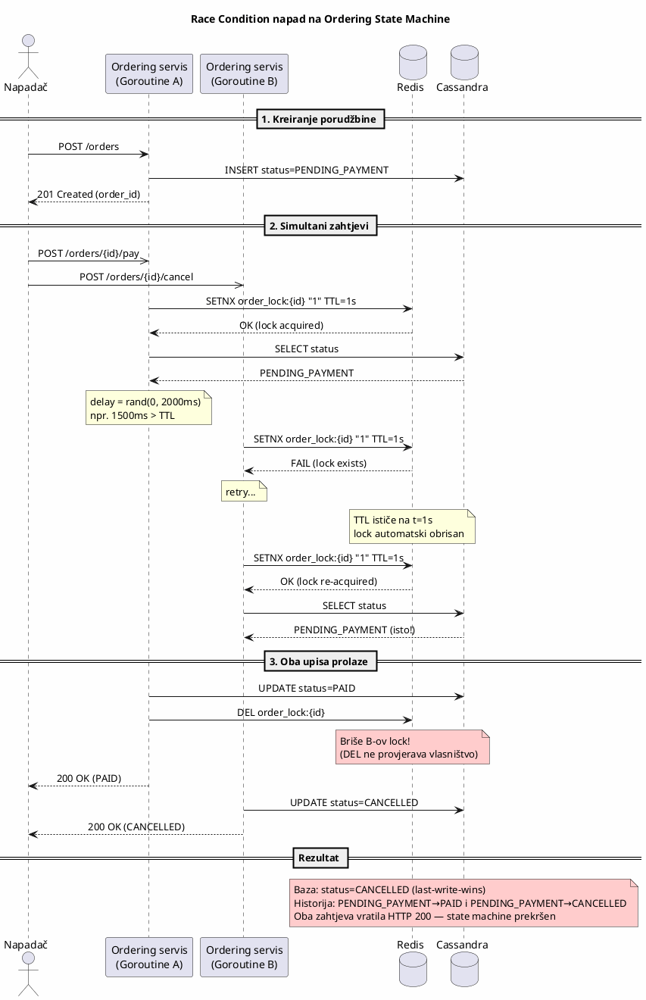

# KT3 — Race Condition napad na Ordering State Machine

###### Danilo Cvijetić R225/2025

---

## 1. Uvod

Ordering sistem predstavlja centralnu komponentu Temu marketplace platforme koja upravlja životnim ciklusom porudžbina. Svaka porudžbina prolazi kroz niz stanja definisanih konačnim automatom (state machine):

```
PENDING_PAYMENT → PAID → SHIPPING → DELIVERED
       ↓                     ↓
   CANCELLED            SHIP_FAILED
```

Tranzicije stanja se pokreću iz dva izvora:
- **HTTP zahtjevi korisnika** — npr. kupac otkazuje porudžbinu (`PENDING_PAYMENT → CANCELLED`)
- **Asinhroni događaji** — npr. Payment servis javlja uspješno plaćanje putem Kafka eventa (`PENDING_PAYMENT → PAID`)

Originalna implementacija koristi Redis distribuirani lock baziran na `SETNX` i `DEL` operacijama. Međutim, ovakav pristup ne garantuje vlasništvo nad lock-om, jer Redis ne razlikuje klijente koji su ga postavili. U slučaju isteka TTL-a (slučaj nepredviđeno duge obrade) i preuzimanja lock-a od strane druge instance servisa, originalni vlasnik može nenamjerno obrisati novi lock pozivom `DEL` operacije. Ova situacija dovodi do paralelnog izvršavanja checkout operacija nad istom narudžbinom.

Ovaj dokument opisuje ranjivost non-owner-aware Redis lock-a, demonstrira eksploataciju putem konkurentnih zahtjeva, i prikazuje mitigaciju uvođenjem owner-aware lock mehanizma.

---

## 2. Definicija pretnje

### 2.1 STRIDE klasifikacija

| STRIDE kategorija | Primjenljivost | Obrazloženje |
|---|---|---|
| **Tampering** |  Da | Napadač manipuliše stanjem porudžbine, dovodeći sistem u nekonzistentno stanje. |
| **Elevation of Privilege** |  Da | Napadač postiže ishod koji ne bi smio biti moguć (npr. otkazana porudžbina za koju je plaćanje izvršeno). |
| **Repudiation** |  Da | Istorija statusa bilježi dvije tranzicije iz istog izvornog stanja, što je nemoguća sekvenca u ispravnom sistemu. Forenzika ne može pouzdano utvrditi koji zahtjev je bio "pravi". |
| **Information Disclosure** |  Ne | Napad ne dovodi do curenja podataka. |
| **Denial of Service** |  Ne | Sistem nastavlja da funkcioniše — problem je u integritetu, ne u dostupnosti. |
| **Spoofing** |  Ne | Napadač koristi sopstveni legitimni nalog. |

### 2.2 CWE referenca

- **CWE-362: Concurrent Execution using Shared Resource with Improper Synchronization ('Race Condition')**
- **CWE-367: Time-of-Check Time-of-Use (TOCTOU) Race Condition**

### 2.3 Opis pretnje

Ordering servis koristi Redis `SETNX` (Set if Not eXists) sa TTL-om kao distribuirani lock za serijalizaciju tranzicija stanja. Međutim, lock vrijednost je statički string `"1"` — Redis ne može razlikovati koji klijent je postavio lock.

Kada lock TTL istekne dok je holder još uvijek u fazi obrade (processing), drugi klijent može zauzeti lock putem `SETNX`. Originalni holder tada nenamjerno briše NOVI lock pozivom bezuslovne `DEL` operacije, jer `DEL` ne provjerava vlasništvo. Ovo poništava garanciju međusobnog isključivanja (mutual exclusion) i omogućava paralelne tranzicije stanja na istoj porudžbini.

Ključni problem: **lock vrijednost ne nosi informaciju o vlasništvu**, pa klijent ne može detektovati da je lock koji pokušava obrisati zapravo tuđi.

---

## 3. Afektovani resursi


### 3.1 Ordering podaci — INTEGRITET

Primarni afektovani resurs. Race condition direktno narušava integritet podataka o porudžbini:

- **Status porudžbine** postaje nekonzistentan sa stvarnim stanjem poslovnog procesa. Porudžbina može istovremeno biti i "plaćena" (Payment servis dobio potvrdu) i "otkazana" (kupac dobio potvrdu otkazivanja), dok baza čuva samo jedan od ta dva statusa — koji zavisi od toga čiji upis je stigao posljednji.
- **Istorija statusa** bilježi nemoguću sekvencu: dva zapisa sa istim izvornim stanjem (`PENDING_PAYMENT → PAID` i `PENDING_PAYMENT → CANCELLED`), što ukazuje da je state machine prekršen.
- **Životni ciklus porudžbine** postaje nepredvidiv — dalji procesi (shipping, refund) se mogu pokrenuti na osnovu pogrešnog stanja.

**CIA triada**: Integritet je kompromitovan. Dostupnost nije ugrožena. Poverljivost nije afektovana.

### 3.2 Payment transakcioni podaci — INTEGRITET

Sekundarni afektovani resurs. Ako Payment servis primi potvrdu da je tranzicija `PENDING_PAYMENT → PAID` uspjela (HTTP 200), izvršiće capture sredstava sa platne kartice kupca. Međutim, ako je istovremeno i cancel zahtjev uspjeo, nastaje situacija u kojoj:

- Novac je naplaćen kupcu
- Porudžbina prikazuje status `CANCELLED`
- Automatski refund se ne pokreće jer sistem ne prepoznaje nekonzistentnost

**Poslovni uticaj**: Finansijski gubitak za kupca i potencijalna regulatorna neusaglašenost (PCI DSS zahtijeva integritet transakcija).

### 3.3 Audit logovi — NEPORICANJE

Istorija statusa (tabela `order_status_history`) bilježi obje tranzicije kao uspješne. Sa stanovišta forenzike, sistem prikazuje nemoguću putanju. Dva prelaza iz istog izvornog stanja narušavaju pouzdanost audit trail-a i otežavaju dispute resolution.

### 3.4 Customer Data — INTEGRITET

Kupac dobija HTTP 200 odgovor na cancel zahtjev sa porukom "order cancelled", ali porudžbina može završiti u stanju `PAID`. Kupac vidi pogrešan status ili dobija neočekivanu isporuku. Ovo narušava povjerenje u platformu i može rezultirati disputima i chargeback-ovima.

---

## 4. Model napada

### 4.1 Akter napada

Napadač je **autentifikovani kupac** koji:

- Posjeduje legitimni korisnički nalog
- Ima aktivnu porudžbinu u stanju `PENDING_PAYMENT`
- Razumije da Redis lock nije owner-aware i da se TTL može iskoristiti

Napadač ne mora eskalirati privilegije niti zaobilaziti autentifikaciju. Sve akcije prolaze standardne bezbjednosne kontrole (JWT validacija, RBAC provjera).

### 4.2 Preduslovi

- Ordering servis koristi Redis lock sa `SETNX` + `DEL` bez provjere vlasništva
- `DEL` operacija je bezuslovna — briše lock bez obzira na to ko ga posjeduje
- Processing delay je varijabilan (random 0 do `MAX_PROCESSING_DELAY_MS`) — kada premaši `LOCK_TTL_MS`, lock ističe tokom obrade

### 4.3 Tok napada

Svaki zahtjev dobija random processing delay (0 do `MAX_PROCESSING_DELAY_MS`), čime se simuliraju realni uslovi u produkciji. Kada delay premaši `LOCK_TTL_MS`, lock istekne tokom obrade i race condition postaje moguć:



Kada je delay < TTL, prvi zahtjev završi i oslobodi lock prije isteka, pa drugi zahtjev pročita ažurirano stanje i bude odbijen — race condition se ne dešava. Zato je ishod napada nedeterministički.

---

## 5. Ranjiva arhitektura

### 5.1 Ranjivi kod — `state.go`

Ključna ranjivost je u `Transition()` metodi. Lock koristi statičku vrijednost `"1"` i bezuslovnu `DEL` operaciju:

```go
func (sm *StateMachine) Transition(ctx context.Context, orderID, targetState, reason string) error {
    lockKey := fmt.Sprintf("order_lock:%s", orderID)

    // SETNX sa statičkom vrijednošću "1" — nema informacije o vlasništvu
    acquired, err := sm.rdb.SetNX(ctx, lockKey, "1", sm.lockTTL).Result()
    // ...

    // RANJIVO: bezuslovni DEL — briše BILO ČIJI lock
    defer func() {
        sm.rdb.Del(ctx, lockKey)
    }()

    // Random processing delay — ponekad premaši lock TTL
    delay := time.Duration(rand.Int63n(int64(sm.maxProcessingDelay)))
    time.Sleep(delay)

    // Upis bez provjere da li još uvijek posjedujemo lock
    err = sm.store.UpdateOrderStatus(ctx, orderID, targetState, reason)
    // ...
}
```

Problemi:

1. **Lock vrijednost je statička (`"1"`)** — klijent ne može razlikovati svoj lock od tuđeg.
2. **`DEL` je bezuslovan** — kada lock istekne i drugi klijent ga preuzme, originalni klijent briše tuđi lock.
3. **Nema provjere vlasništva prije upisa** — upis se izvršava čak i ako je lock istekao.

---

## 6. Demonstracija napada

```
chmod +x attack.sh
./attack.sh http://localhost:8080 20
```

Skripta za svaki pokušaj kreira porudžbinu, šalje istovremeni PAY i CANCEL, i provjerava ishod. Zbog random delay-a, ishod varira:

- `RACE` — oba zahtjeva vratila 200 (delay > TTL, lock istekao, oba pisala u bazu)
- `OK` — samo jedan uspio (delay < TTL, lock držao do kraja, drugi pročitao ažurirano stanje)

```
=== Race Condition Attack ===
Target:   http://localhost:8080
Attempts: 20

  #01  OK     pay=409 cancel=200 final=CANCELLED
  #02  RACE   pay=200 cancel=200 final=PAID
  #03  OK     pay=409 cancel=200 final=CANCELLED
  #04  OK     pay=200 cancel=409 final=PAID
  #05  OK     pay=200 cancel=409 final=PAID
  #06  OK     pay=409 cancel=200 final=CANCELLED
  #07  OK     pay=200 cancel=409 final=PAID
  #08  RACE   pay=200 cancel=200 final=PAID
  #09  RACE   pay=200 cancel=200 final=CANCELLED
  #10  RACE   pay=200 cancel=200 final=CANCELLED
  ...

--- Results ---
  Total:  20
  RACE:   7  (both succeeded — vulnerable!)
  OK:     13  (one succeeded, one rejected)
  SAFE:   0  (both rejected — fail-safe)
  ERRORS: 0

VULNERABLE: 7/20 resulted in race condition.
```

Svaki `RACE` predstavlja narušavanje state machine-a — oba zahtjeva su dobila HTTP 200, a konačno stanje zavisi od last-write-wins. Istorija takve porudžbine bilježi dva zapisa (`PENDING_PAYMENT → PAID` i `PENDING_PAYMENT → CANCELLED`), što je nemoguća sekvenca u ispravnom sistemu.

---

## 7. Mitigacija

Mitigacija se postiže uvođenjem **owner-aware lock mehanizma**. Patch se nalazi u `fix.patch` i mijenja isključivo `state.go`. Tri ključne promjene:

**1. UUID kao lock vrijednost** — umjesto statičkog `"1"`, svaki zahtjev čuva `uuid.New().String()` kao lock vrijednost. Ovo omogućava identifikaciju vlasnika.

**2. Lua skripta za release** — umjesto bezuslovnog `DEL`, lock se otpušta atomskom Lua skriptom koja provjerava da li je lock vrijednost još uvijek naša prije brisanja:

```lua
if redis.call("GET", KEYS[1]) == ARGV[1] then
    return redis.call("DEL", KEYS[1])
end
return 0
```

**3. Ownership check prije upisa** — prije pisanja u Cassandru, `GET` lock i provjera da li je vrijednost jednaka našem UUID-u. Ako nije (lock istekao ili ga preuzeo drugi klijent), tranzicija se odbija sa `ErrLockExpired`.

### Primjena i revert

```bash
# primjena
patch -p0 < fix.patch
docker compose build ordering-service --no-cache
docker compose up -d ordering-service

# revert
patch -R -p0 < fix.patch
docker compose build ordering-service --no-cache
docker compose up -d ordering-service
```

---

## 8. Analiza logova aplikacije

### 8.1 Logovi u ranjivom stanju (prije patch-a)

#### RACE ishod — oba zahtjeva uspjela (delay > TTL)

```
[handler] Created order f7ee40a2-...: customer=lograce_1 (total=49.99)
[state]   Order f7ee40a2-...: lock acquired (value="1", TTL=1s)          ← PAY zauzima lock
[state]   Order f7ee40a2-...: processing (1.520s delay)...               ← delay (1.52s) > TTL (1s)
                                                                          ← lock ISTEKAO nakon 1s, PAY još obrađuje
[state]   Order f7ee40a2-...: lock acquired (value="1", TTL=1s)          ← CANCEL zauzima NOVI lock (SETNX uspijeva jer je TTL istekao)
[state]   Order f7ee40a2-...: processing (252ms delay)...                ← CANCEL obrađuje sa kratkim delay-em
[state]   Order f7ee40a2-...: PENDING_PAYMENT → PAID COMMITTED          ← PAY upisuje — NE provjerava vlasništvo
[state]   Order f7ee40a2-...: lock released (DEL)                        ← PAY briše CANCEL-ov lock (bezuslovni DEL)!
[handler] Order f7ee40a2-... marked as PAID (payment_id=pay_1)
[state]   Order f7ee40a2-...: PENDING_PAYMENT → CANCELLED COMMITTED     ← CANCEL upisuje — lock je obrisan, nema zaštite
[state]   Order f7ee40a2-...: lock released (DEL)                        ← CANCEL poziva DEL na već obrisanom lock-u (no-op)
[handler] Order f7ee40a2-... CANCELLED (reason: cancel 1)
```

Oba zahtjeva su izvršila `COMMITTED` iz istog izvornog stanja (`PENDING_PAYMENT`). Istorija porudžbine sada sadrži dva zapisa — `PENDING_PAYMENT → PAID` i `PENDING_PAYMENT → CANCELLED` — što je nemoguća sekvenca u ispravnom state machine-u. Problem nastaje jer:

1. PAY-ov lock istekne tokom obrade (delay 1.52s > TTL 1s)
2. CANCEL zauzme novi lock sa istom statičkom vrijednošću `"1"`
3. PAY završi obradu i pozove `DEL` — briše CANCEL-ov lock jer `DEL` ne provjerava vlasništvo
4. CANCEL završi obradu bez ikakve zaštite (lock je već obrisan)

#### OK ishod — jedan zahtjev uspio (delay < TTL)

```
[handler] Created order b352ba03-...: customer=oktest_3 (total=49.99)
[state]   Order b352ba03-...: lock acquired (value="1", TTL=1s)          ← PAY zauzima lock
[state]   Order b352ba03-...: processing (55ms delay)...                 ← delay (55ms) << TTL (1s)
[state]   Order b352ba03-...: PENDING_PAYMENT → PAID COMMITTED          ← PAY upisuje dok lock još važi
[state]   Order b352ba03-...: lock released (DEL)                        ← PAY oslobađa SVOJ lock (ispravno)
[handler] Order b352ba03-... marked as PAID (payment_id=pay_ok_3)
[state]   Order b352ba03-...: lock acquired (value="1", TTL=1s)          ← CANCEL zauzima lock
                                                                          ← CANCEL čita status: PAID (ažurirano)
[state]   Order b352ba03-...: lock released (DEL)                        ← tranzicija PAID→CANCELLED nije dozvoljena, lock se oslobađa
```

Kada je delay < TTL, PAY završi obradu i oslobodi lock prije isteka. CANCEL zauzme lock, pročita ažurirano stanje (`PAID`), i tranzicija `PAID → CANCELLED` nije dozvoljena — state machine radi ispravno. Ranjivost se manifestuje samo kada delay > TTL.

---

### 8.2 Logovi u patchovanom stanju (poslije patch-a)

#### SAFE ishod — oba zahtjeva odbijena (delay > TTL, ownership detektovan)

```
[handler] Created order ba486437-...: customer=safe_test_1 (total=49.99)
[state]   Order ba486437-...: lock acquired (owner=311d01f2, TTL=1s)     ← PAY zauzima lock sa UUID 311d01f2...
[state]   Order ba486437-...: processing (1.100s delay)...               ← delay (1.1s) > TTL (1s)
                                                                          ← lock ISTEKAO nakon 1s
[state]   Order ba486437-...: lock acquired (owner=1cf03512, TTL=1s)     ← CANCEL zauzima NOVI lock sa DRUGIM UUID-em 1cf03512...
[state]   Order ba486437-...: processing (1.628s delay)...               ← CANCEL obrađuje
[state]   Order ba486437-...: lock stolen (expected=311d01f2, found=1cf03512), aborting  ← PAY detektuje da lock više nije NJEGOV
[state]   Order ba486437-...: lock NOT released (ownership lost)         ← PAY NE briše tuđi lock (Lua skripta provjerava UUID)
                                                                          ← CANCEL-ov lock istekne (delay 1.628s > TTL 1s)
[state]   Order ba486437-...: lock expired during processing, aborting   ← CANCEL detektuje istek SVOG lock-a
[state]   Order ba486437-...: lock NOT released (ownership lost)         ← CANCEL NE briše (lock već istekao)
```

Nijedan zahtjev nije upisao promjenu stanja. Oba su detektovala gubitak vlasništva i odbila upis:

1. PAY detektuje da je lock ukraden — `GET` vraća UUID `1cf03512` umjesto očekivanog `311d01f2` → `ErrLockExpired`
2. CANCEL detektuje da je lock istekao — `GET` vraća `redis.Nil` → `ErrLockExpired`
3. Lua skripta za release sprečava brisanje tuđeg lock-a — `DEL` se izvršava samo ako `GET == ARGV[1]`

Porudžbina ostaje u `PENDING_PAYMENT` stanju — ovo je **fail-safe** ponašanje. Korisnik može ponovo pokušati operaciju.

#### OK ishod — jedan zahtjev uspio (delay < TTL, ownership verifikovan)

```
[handler] Created order 70546fc4-...: customer=ok_fix_3 (total=49.99)
[state]   Order 70546fc4-...: lock acquired (owner=3648301b, TTL=1s)     ← PAY zauzima lock sa UUID 3648301b...
[state]   Order 70546fc4-...: processing (411ms delay)...                ← delay (411ms) < TTL (1s)
                                                                          ← ownership check: GET lock → 3648301b == 3648301b ✓
[state]   Order 70546fc4-...: PENDING_PAYMENT → PAID COMMITTED          ← PAY upisuje — vlasništvo verifikovano
[state]   Order 70546fc4-...: lock released (owner verified)             ← Lua skripta: GET == UUID → DEL (ispravno oslobođen)
[handler] Order 70546fc4-... marked as PAID (payment_id=pay_f_3)
[state]   Order 70546fc4-...: lock acquired (owner=e9787577, TTL=1s)     ← CANCEL zauzima lock
                                                                          ← CANCEL čita status: PAID (ažurirano)
[state]   Order 70546fc4-...: lock released (owner verified)             ← tranzicija PAID→CANCELLED nije dozvoljena
```

PAY provjerava vlasništvo prije upisa (`GET lock == UUID`), potvrđuje da je lock još uvijek njegov, i upisuje. Lua skripta za release verifikuje UUID prije brisanja. CANCEL zauzme lock, pročita ažurirano stanje (`PAID`), i biva odbijen jer tranzicija `PAID → CANCELLED` nije dozvoljena.

---

## 9. Demonstracija mitigacije

```bash
./attack.sh http://localhost:8080 20
```

Očekivani rezultat — mješavina `OK` (delay < TTL, jedan uspije) i `SAFE` (delay > TTL, oba odbijena). Ne postoji race ishod (`RACE`):

```
=== Race Condition Attack ===
Target:   http://localhost:8080
Attempts: 20

  #01  SAFE   pay=409 cancel=409 final=PENDING_PAYMENT
  #02  OK     pay=200 cancel=409 final=PAID
  #03  OK     pay=409 cancel=200 final=CANCELLED
  #04  OK     pay=409 cancel=200 final=CANCELLED
  #05  SAFE   pay=409 cancel=409 final=PENDING_PAYMENT
  #06  SAFE   pay=409 cancel=409 final=PENDING_PAYMENT
  #07  OK     pay=200 cancel=409 final=PAID
  #08  OK     pay=200 cancel=409 final=PAID
  #09  OK     pay=409 cancel=200 final=CANCELLED
  #10  OK     pay=200 cancel=409 final=PAID
  ...

--- Results ---
  Total:  20
  RACE:   0  (both succeeded — vulnerable!)
  OK:     16  (one succeeded, one rejected)
  SAFE:   4  (both rejected — fail-safe)
  ERRORS: 0

NO RACE CONDITIONS DETECTED.
```

`SAFE` ishodi se dešavaju kada oba zahtjeva dobiju delay > TTL — oba detektuju gubitak vlasništva i odbiju upis. Ovo je ispravno fail-safe ponašanje.
