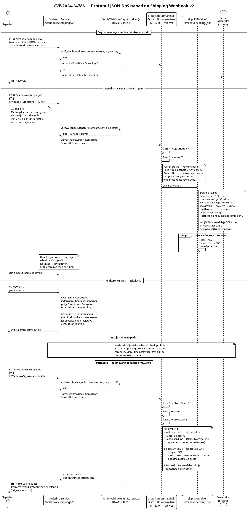

# KT3 — CVE-2024-24786 DoS napad na Shipping Webhook v2 (Protobuf JSON)

###### Danilo Cvijetić R225/2025

---

## 1. Uvod

### 1.1 Zašto Protobuf na Shipping v2 endpointu?

Originalni Shipping webhook endpoint (`/webhooks/shipping`) prima događaje u čistom JSON formatu. Iako je JSON jednostavan i čitljiv, ima značajne nedostatke u kontekstu integracije sa eksternim logističkim provajderima:

- **Nema ugovorene šeme (schema)** — JSON payload nema formalnu definiciju strukture. Svaki logistički provajder (DHL, FedEx, UPS, lokalni kuriri) može slati payload sa različitim imenima polja, tipovima podataka i strukturom. Ordering servis mora implementirati poseban parser za svakog provajdera.
- **Nema evolucije šeme (schema evolution)** — kada provajder doda novo polje ili promijeni tip postojećeg, JSON endpoint nema mehanizam za detekciju nekompatibilnosti. Greške se manifestuju tek u produkciji kao runtime parse error-i.
- **Nema tipske bezbjednosti** — JSON dozvoljava proizvoljne tipove za svako polje. Broj može biti string, niz može biti objekat, itd. Ovo otvara prostor za subtle bugove koji se teško dijagnostikuju.

**Protocol Buffers (Protobuf)** rješava ove probleme uvođenjem formalne šeme (`*.proto` fajlovi) koja definiše strukturu poruka, tipove polja i pravila kompatibilnosti. Ključne prednosti Protobuf-a u kontekstu webhook integracije sa logističkim provajderima:

1. **Standardizovani envelope format** — `google.protobuf.Any` tip omogućava da svaki provajder šalje podatke u sopstvenom formatu, dok Ordering servis koristi uniformni envelope za rutiranje i verifikaciju. Polje `@type` u Any envelopeu identifikuje konkretni tip payload-a, pa servis može podržati više provajdera bez izmjene koda za prijem.

2. **Forward i backward kompatibilnost** — Protobuf šema podržava dodavanje novih polja bez narušavanja postojećih klijenata. Kada DHL doda novo polje `estimated_delivery_time`, servis koji koristi stariju verziju šeme može bezbijedno ignorisati nepoznato polje (mehanizam `DiscardUnknown`). Obrnuto, kada servis doda obavezno polje, stariji klijenti nastavljaju da rade jer Protobuf koristi numeričke identifikatore polja umjesto imena.

### 1.2 Ranjivost

Upravo mehanizam `DiscardUnknown` — koji je ključan za kompatibilnost sa različitim provajderima — otvara vektor napada u kombinaciji sa ranjivom verzijom `google.golang.org/protobuf` biblioteke.

U demo aplikaciji endpoint `/webhooks/shipping/v2` koristi `protojson.Unmarshal` sa opcijom `DiscardUnknown: true` za parsiranje `google.protobuf.Any` envelope-a:

```go
unmarshalOpts := protojson.UnmarshalOptions{DiscardUnknown: true}
err := unmarshalOpts.Unmarshal(rawBody, &envelope)
```

Ranjivost je zasnovana na postojećem CVE-u:

| Polje | Vrijednost |
|---|---|
| **CVE** | CVE-2024-24786 |
| **GHSA** | GHSA-8r3f-844c-mc37 |
| **Go Advisory** | GO-2024-2611 |
| **Pogođena biblioteka** | `google.golang.org/protobuf` |
| **Pogođene verzije** | `< 1.33.0` |
| **Rizična grana izvrsavanja** | `protojson.Unmarshal` sa `DiscardUnknown=true` ili `google.protobuf.Any` |
| **CVSS v4** | 6.6 (Moderate) |

Napadač šalje specifičan malformed protobuf-JSON payload koji izaziva **beskonačnu petlju** u internom JSON dekoderu biblioteke. Handler goroutina se nikada ne vraća, trošeći 100% jednog CPU jezgra. Sa samo 5 konkurentnih zahtjeva, CPU potrošnja servisa raste na ~600%.

---

## 2. Definicija pretnje

### 2.1 STRIDE klasifikacija

| STRIDE kategorija | Primjenljivost | Obrazloženje |
|---|---|---|
| **Denial of Service** | Da | Napadač izaziva beskonačnu petlju u parseru koja troši CPU neograničeno. Svaki napadački zahtjev trajno zarobljava jednu goroutinu. Akumulacijom zahtjeva servis postaje neupotrebljiv. |
| **Tampering** | Ne | Napad ne mijenja podatke u sistemu — payload ne prolazi fazu parsiranja pa se ne procesira. |
| **Spoofing** | Ne | Napadač ne imitira identitet drugog aktera. |
| **Information Disclosure** | Ne | Napad ne dovodi do curenja podataka. |
| **Repudiation** | Ne | Napad ne otežava forenziku — logovi bilježe dolazni zahtjev. |
| **Elevation of Privilege** | Ne | Napadač ne eskalira privilegije. |

### 2.2 CWE referenca

- **CWE-835: Loop with Unreachable Exit Condition ('Infinite Loop')** — Interni JSON dekoder `protojson` biblioteke u verzijama `< 1.33.0` ne obrađuje slučaj kada `skipJSONValue()` funkcija primi `EOF` token. Funkcija ostaje u petlji koja nema dostižan izlazni uslov.
- **CWE-400: Uncontrolled Resource Consumption** — Beskonačna petlja troši 100% jednog CPU jezgra po zahtjevu. Goroutina se ne oslobađa čak ni nakon prekida klijentske konekcije jer `protojson.Unmarshal` ne provjerava `context.Context` cancellation.

### 2.3 Opis pretnje

Interni JSON dekoder u `protojson` paketu (`google.golang.org/protobuf/internal/encoding/json`) sadrži bug u funkciji `Decoder.Read()` koja parsira JSON tokene. Kada dekoder pročita `}` token (ObjectClose) u poziciji gdje se očekuje vrijednost polja (nakon Name tokena), provjera validnosti u ranjivoj verziji je nepotpuna:

**Ranjiva verzija (v1.32.0):**
```go
case ObjectClose:
    if len(d.openStack) == 0 ||
        d.lastToken.kind == comma ||    // ← provjerava SAMO comma
        d.openStack[len(d.openStack)-1] != ObjectOpen {
        return Token{}, d.newSyntaxError(...)
    }
```

**Ispravljena verzija (v1.33.0):**
```go
case ObjectClose:
    if len(d.openStack) == 0 ||
        d.lastToken.kind&(Name|comma) != 0 ||    // ← provjerava Name I comma
        d.openStack[len(d.openStack)-1] != ObjectOpen {
        return Token{}, d.newSyntaxError(...)
    }
```

U ranjivoj verziji, `}` nakon Name tokena **ne proizvodi grešku**. Dekoder prihvata `}` kao ObjectClose, ali stanje parsera postaje nekonzistentno. Kada `protojson` sa `DiscardUnknown=true` pozove `skipJSONValue()` da preskoči vrijednost nepoznatog polja, funkcija ulazi u petlju čitanja tokena. Dekoder vraća `EOF` token, ali `skipJSONValue()` **nema `case` za `EOF`** — nastavlja petlju beskonačno.

**Ranjiva `skipJSONValue()` — nedostaje `case json.EOF`:**
```go
func (d decoder) skipJSONValue() error {
    var open int
    for {
        tok, err := d.Read()
        if err != nil { return err }
        switch tok.Kind() {
        case json.ObjectOpen, json.ArrayOpen:
            open++
            // ... recursion limit check
        // ← NEMA case json.EOF — petlja se nastavlja beskonačno!
        }
        if open == 0 { return nil }
    }
}
```

**Ispravljena `skipJSONValue()` — dodat `case json.EOF`:**
```go
case json.EOF:
    // This can only happen if there's a bug in Decoder.Read.
    // Avoid an infinite loop if this does happen.
    return errors.New("unexpected EOF")
```

Ovo znači da payload `{"":}` — JSON objekat sa praznim ključem i nedostajućom vrijednošću pokreće beskonačnu petlju sa 100% CPU potrošnje po goroutini.

---

## 3. Afektovani resursi

### 3.1 Compute resursi — DOSTUPNOST

Primarni afektovani resurs. Svaki napadački zahtjev trajno zauzima jednu goroutinu koja troši 100% jednog CPU jezgra:

- **CPU potrošnja** raste linearno sa brojem zahtjeva: 5 zahtjeva = ~600% CPU
- **Goroutine leak** — zarobljene goroutine se ne oslobađaju čak ni kada klijent prekine konekciju. `protojson.Unmarshal` je sinhrana operacija koja ne provjerava `context.Context`, pa chi middleware timeout (30s) otkazuje kontekst ali ne može prekinuti goroutinu
- **Akumulacija** — svaki novi napadački zahtjev dodaje novu zarobljenu goroutinu. Bez restarta procesa, goroutine se nakupljaju neograničeno

**CIA triada**: Dostupnost je kompromitovana. Integritet i poverljivost nisu afektovani.

### 3.2 Ordering servis — DOSTUPNOST

Sekundarni afektovani resurs. Iako health endpoint nastavlja da odgovara, performanse servisa su značajno degradirane:

- Legitimni webhook zahtjevi moraju se takmičiti za CPU sa zarobljenim goroutinama
- Tranzicije stanja porudžbina (pay, cancel, ship) se usporavaju
- U ekstremnom slučaju (dovoljno konkurentnih napada), Go runtime scheduler ne može efikasno rasporediti goroutine i servis postaje efektivno neupotrebljiv

### 3.3 Logistički webhook processing — DOSTUPNOST

Webhook-ovi od legitimnih logističkih provajdera (DHL, FedEx, UPS) ne mogu biti obrađeni u razumnom vremenu:

- Potvrde isporuke (`DELIVERED`) kasne — kupci ne dobijaju obavještenje
- Gubitak pošiljke (`LOST`) nije detektovan na vrijeme — refund se ne pokreće
- SLA sa logističkim provajderima može biti prekršen ako servis ne potvrdi prijem webhook-a (HTTP 200) u dogovorenom roku

### 3.4 Infrastruktura — DOSTUPNOST

Visoka CPU potrošnja utiče na infrastrukturu:

- Kontejner ili VM koji hostuje servis troši više resursa nego što je alocirano
- U dijeljenom okruženju (Kubernetes, shared VM), ostali servisi gube CPU resurse
- Auto-scaling mehanizmi mogu pogrešno interpretirati visoku CPU potrošnju kao legitimno opterećenje i skalirati nepotrebno, povećavajući troškove

---

## 4. Model napada

### 4.1 Akter napada

Napadač je **eksterni akter** koji:

- Može slati HTTP zahtjeve ka `/webhooks/shipping/v2` endpointu
- Poznaje webhook secret (npr. iz curenja konfiguracije, docker-compose.yml-a, ili log fajlova) **ILI** ima pristup javno dostupnom API-ju koji ne zahtijeva autentifikaciju za webhook endpoint
- Ne mora poznavati detalje sistema — payload `{"":}` je generički i ne zavisi od poslovne logike

Napadač **ne mora imati korisnički nalog** niti poznavanje ordering sistema. Dovoljno je da može poslati HTTP POST zahtjev sa validnim HMAC potpisom.

### 4.2 Preduslovi

- Ordering servis koristi `google.golang.org/protobuf` u verziji `< 1.33.0`
- Endpoint `/webhooks/shipping/v2` koristi `protojson.UnmarshalOptions{DiscardUnknown: true}`
- Napadač poznaje webhook secret za HMAC potpis (ili je endpoint dostupan bez HMAC verifikacije)
- Endpoint je mrežno dostupan napadaču

### 4.3 Tok napada



Ključni korak je **korak 5**: `protojson.Unmarshal` ulazi u beskonačnu petlju jer interni JSON dekoder ne prepoznaje `}` nakon Name tokena kao grešku, a `skipJSONValue()` nema izlaz za `EOF` token.

---

## 5. Ranjiva arhitektura

### 5.1 Ranjivi kod — `handlers.go` (ShippingWebhookV2)

Ključna ranjivost je u parsiranju protobuf-JSON envelope-a sa `DiscardUnknown: true`:

```go
func (h *Handlers) ShippingWebhookV2(w http.ResponseWriter, r *http.Request) {
    rawBody, err := io.ReadAll(r.Body)
    // ...

    // HMAC verifikacija nad sirovim bajtovima — prolazi za BILO KOJI payload
    if !VerifyWebhookSignatureRaw(rawBody, signature, h.webhookSecret) {
        // ... 401
    }

    log.Printf("[webhook-v2] Signature verification PASSED")

    // RANJIVO: protojson.Unmarshal sa DiscardUnknown=true
    // na google.golang.org/protobuf v1.32.0
    var envelope anypb.Any
    unmarshalOpts := protojson.UnmarshalOptions{
        DiscardUnknown: true,    // ← omogućava skipJSONValue() granu izvrsavanja
    }
    if err := unmarshalOpts.Unmarshal(rawBody, &envelope); err != nil {
        // ← NIKADA SE NE IZVRŠAVA za {"":} payload jer Unmarshal
        //   ulazi u beskonačnu petlju PRIJE nego što vrati grešku
        log.Printf("[webhook-v2] Failed to parse protobuf-JSON envelope: %v", err)
        writeJSON(w, http.StatusBadRequest, ...)
        return
    }

    // ... ostatak handlera se nikada ne izvršava
}
```

Problemi:

1. **`DiscardUnknown: true`** — ova opcija je neophodna za kompatibilnost sa različitim logističkim provajderima (da bi servis mogao ignorisati nepoznata polja). Međutim, u kombinaciji sa ranjivom verzijom biblioteke, aktivira granu izvrsvanja `skipJSONValue()` koji sadrži bug.
2. **`google.golang.org/protobuf v1.32.0`** — interni JSON dekoder u ovoj verziji ne prepoznaje `}` nakon Name tokena kao grešku, i `skipJSONValue()` nema izlaz za `EOF` token.
3. **Nema timeout-a na nivou parsiranja** — `protojson.Unmarshal` ne prima `context.Context` pa se ne može prekinuti iz spoljašnjeg koda. Čak i chi middleware timeout otkazuje samo kontekst, ali goroutina nastavlja petlju.

Za payload `{"":}`, interni JSON dekoder prolazi sljedeće korake:

---

## 6. Demonstracija napada

```bash
cd shipping-v2-protobuf
chmod +x attack.sh
./attack.sh http://localhost:8080
```

Skripta provodi sljedeće korake:

1. Kreira porudžbinu i dovodi je do stanja `SHIPPING`
2. Šalje validan protobuf-JSON webhook (kontrolni korak — potvrđuje da endpoint radi)
3. Šalje napadački payload `{"":}` sa validnim HMAC potpisom
4. Mjeri vrijeme odgovora — na ranjivom sistemu curl timeout-uje (≥8s)
5. Pokreće 5 konkurentnih napadačkih zahtjeva i mjeri CPU potrošnju

```
=== CVE-2024-24786 Attack (Shipping Webhook v2 — Protobuf JSON DoS) ===
Target: http://localhost:8080
Secret: super-secret-webhook-key-2024

0. Servis je aktivan
1. Kreirana porudžbina 56122732-... (total=$999.99)
2. Porudžbina plaćena
3. Porudžbina poslata (state=SHIPPING)
4. Poslan validan protobuf-JSON webhook -> HTTP 200

5. Slanje napadačkog payload-a: {"":}
   (očekivano: timeout/8s na ranjivom parseru)

--- Rezultat pojedinačnog napada ---
  curl exit code: 28 (timeout)
  Trajanje: 8010ms (>= 8s timeout)

RANJIVO: napadački payload uzrokovao beskonačnu petlju u parseru.
  Handler se nije vratio u roku od 8s.

6. Pokretanje konkurentnog DoS napada (5 zahtjeva)...
   Svaki zahtjev zauzima jednu goroutine sa 100% CPU u beskonačnoj petlji.

   Docker stats (tokom napada):

   ordering-service  CPU: 599.09%  MEM: 9.598MiB / 27.09GiB

   Health check: dostupan (ali CPU je zasićen)

```

rezultati:

- **Korak 5**: curl timeout-uje nakon 8 sekundi jer handler nikada ne vrati HTTP odgovor — `protojson.Unmarshal` je u beskonačnoj petlji
- **Korak 6**: 5 konkurentnih zahtjeva zauzimaju ~600% CPU (svaki na jednom jezgru). Memorija ostaje stabilna (~9.6 MiB) jer petlja ne alocira memoriju — troši isključivo CPU
- **Health check**: servis još uvijek odgovara na health endpoint jer Go scheduler obrađuje i druge goroutine, ali sa značajno degradiranim performansama

---

## 7. Mitigacija

Mitigacija se postiže kombinacijom dvije promjene u `fix.patch`:

**1. Upgrade protobuf biblioteke na `v1.33.0`** — ispravljena verzija sadrži dva fix-a u internom JSON dekoderu:

- `Decoder.Read()` sada prepoznaje `}` nakon Name tokena kao grešku: `lastToken.kind&(Name|comma) != 0` → syntax error
- `skipJSONValue()` ima `case json.EOF` koji vraća grešku umjesto beskonačnog petljanja

**2. `DiscardUnknown: false`** — defense-in-depth mjera. Kada je `DiscardUnknown` postavljen na `false`, parser odbija poruku čim naiđe na nepoznato polje, bez pokušaja preskakanja. Ovo eliminiše čitavu `skipJSONValue()` granu izvrsavanja.

Ispravljen kod:

```go
// Patched: strict parsing path + fixed protobuf version.
var envelope anypb.Any
unmarshalOpts := protojson.UnmarshalOptions{
    DiscardUnknown: false,    // ← striktno parsiranje — odbija nepoznata polja
}
if err := unmarshalOpts.Unmarshal(rawBody, &envelope); err != nil {
    log.Printf("[webhook-v2] Failed to parse protobuf-JSON envelope: %v", err)
    writeJSON(w, http.StatusBadRequest, ErrorResponse{Error: "invalid protobuf-json envelope"})
    return
}
```

**Napomena o kompatibilnosti**: postavljanje `DiscardUnknown: false` zrnači da servis više ne toleriše nepoznata polja od logističkih provajdera. U produkciji, ovo zahtijeva da svi provajderi koriste dogovorenu Protobuf šemu. Alternativno, ako je kompatibilnost sa raznolikim provajderima prioritet, dovoljno je samo upgrade-ovati biblioteku na `v1.33.0+` bez promjene `DiscardUnknown` — fix u dekoderu eliminiše beskonačnu petlju čak i sa `DiscardUnknown: true`.

### Primjena i revert

```bash
# primjena
cd ../demo
patch -p0 < ../shipping-v2-protobuf/fix.patch
rm -f go.sum
docker compose build ordering-service --no-cache
docker compose up -d ordering-service

# revert
cd ../demo
patch -R -p0 < ../shipping-v2-protobuf/fix.patch
rm -f go.sum
docker compose build ordering-service --no-cache
docker compose up -d ordering-service
```

---

## 8. Analiza logova aplikacije

### 8.1 Logovi u ranjivom stanju (prije patch-a)

#### Validan v2 webhook (kontrolni korak)

```
[webhook-v2] Signature verification PASSED
[webhook-v2] Received event: shipment=SH-aa0b6f3d order=aa0b6f3d-... type=status_update status=IN_TRANSIT
[webhook-v2] Order aa0b6f3d-...: shipment SH-aa0b6f3d is in transit
```

Legitiman protobuf-JSON webhook prolazi kompletnu obradu:

1. HMAC verifikacija nad sirovim bajtovima → `PASSED`
2. `protojson.Unmarshal` uspješno parsira `google.protobuf.Any` envelope
3. Unutrašnji payload se dekodira iz `StringValue` u `ShippingWebhookEvent`
4. Handler procesira događaj — status `IN_TRANSIT` se loguje

#### Napadački payload `{"":}` (DoS)

```
[webhook-v2] Signature verification PASSED
```

Log sadrži **samo jednu liniju**. Servis prima napadački payload `{"":}`:

1. HMAC verifikacija prolazi jer se HMAC računa nad sirovim bajtovima — payload `{"":}` ima validan HMAC
2. `protojson.Unmarshal` započinje parsiranje envelope-a
3. Interni dekoder čita `{`, zatim `""` (Name token), zatim `}` — bug: ne prepoznaje `}` nakon Name kao grešku
4. `skipJSONValue()` ulazi u beskonačnu petlju — handler **nikada ne završi**
5. Log poruka `Failed to parse protobuf-JSON envelope: ...` se **nikada ne ispisuje** jer `Unmarshal` nikada ne vrati rezultat

Odsustvo bilo kakvog log zapisa nakon `Signature verification PASSED` je ključni dijagnostički indikator ranjivosti. Normalan tok bi trebao imati ili `Received event:` (uspješno parsiranje) ili `Failed to parse:` (greška parsiranja). Ni jedno ni drugo znaci handler je zarobljen.

#### CPU potrošnja tokom napada

```
$ docker stats --no-stream ordering-service
NAME               CPU %     MEM USAGE / LIMIT
ordering-service   599.09%   9.598MiB / 27.09GiB
```

Sa 5 konkurentnih napadačkih zahtjeva, CPU potrošnja je ~600%. Memorija ostaje stabilna jer beskonačna petlja ne alocira memoriju i troši isključivo CPU cikluse. Goroutine se ne oslobađaju jer:

- `protojson.Unmarshal` ne provjerava `context.Context` — nema mehanizma za eksternu notifikaciju
- Chi middleware timeout (30s) otkazuje kontekst ali ne može prekinuti goroutinu
- Client disconnect ne utiče na goroutinu jer je petlja u potpunosti CPU-bound

---

### 8.2 Logovi u patchovanom stanju (poslije patch-a)

#### Napadački payload `{"":}` (odbijen)

```
[webhook-v2] Signature verification PASSED
[webhook-v2] Failed to parse protobuf-JSON envelope: proto: syntax error (line 1:5): unexpected token }
```

Nakon primjene patch-a, isti napadački payload `{"":}` proizvodi dva log zapisa:

1. HMAC verifikacija i dalje prolazi — potpis je validan za date sirove bajtove
2. `protojson.Unmarshal` **odmah** (za <1ms) vraća grešku: `syntax error (line 1:5): unexpected token }`
3. Handler vraća HTTP 400 Bad Request sa porukom `invalid protobuf-json envelope`

Ispravljen interni dekoder u v1.33.0 prepoznaje `}` na poziciji 5 (nakon Name tokena `""`) kao neočekivani token:

- **Provjera u `Decoder.Read()`**: `lastToken.kind&(Name|comma) != 0` → `true` (lastToken je Name) → syntax error
- Čak i da provjera ne uhvati grešku, `skipJSONValue()` sada ima `case json.EOF` koji vraća `unexpected EOF` umjesto beskonačnog petljanja
- Dodatno, `DiscardUnknown: false` odbija nepoznata polja bez pokušaja preskakanja — čitava `skipJSONValue()` grana se ne izvršava

#### CPU potrošnja nakon patch-a

```
$ docker stats --no-stream ordering-service
NAME               CPU %     MEM USAGE / LIMIT
ordering-service   0.00%     7.512MiB / 27.09GiB
```

CPU potrošnja je 0% nakon obrade napadačkog zahtjeva. Nema zarobljenih goroutina, nema memory leak-a. Servis nastavlja normalan rad.

---

## 9. Demonstracija mitigacije

```bash
./attack.sh http://localhost:8080
```

Očekivani rezultat nakon primjene patch-a — napadački payload se odmah odbija sa HTTP 400:

```
=== CVE-2024-24786 Attack (Shipping Webhook v2 — Protobuf JSON DoS) ===
Target: http://localhost:8080
Secret: super-secret-webhook-key-2024

0. Servis je aktivan
1. Kreirana porudžbina 9e3c78dd-... (total=$999.99)
2. Porudžbina plaćena
3. Porudžbina poslata (state=SHIPPING)
4. Poslan validan protobuf-JSON webhook -> HTTP 200

5. Slanje napadačkog payload-a: {"":}
   (očekivano: timeout/8s na ranjivom parseru)

--- Rezultat pojedinačnog napada ---
  HTTP code: 400
  Body: {"error":"invalid protobuf-json envelope"}
  Trajanje: 5ms

NIJE RANJIVO (patchovano): napadački payload odmah odbijen.
```

Servis ispravno odbija malformed payload za 5 milisekundi (umjesto beskonačne petlje). Validni protobuf-JSON webhook-ovi nastavljaju da rade normalno (korak 4: HTTP 200).

---

## 10. Reference

- [CVE-2024-24786 (NVD)](https://nvd.nist.gov/vuln/detail/CVE-2024-24786)
- [GO-2024-2611 (Go Advisory)](https://pkg.go.dev/vuln/GO-2024-2611)
- [GHSA-8r3f-844c-mc37 (GitHub Advisory)](https://github.com/advisories/GHSA-8r3f-844c-mc37)
- [Fix commit (protobuf-go)](https://github.com/protocolbuffers/protobuf-go/commit/f01a588) — encode/protojson: handle missing object values
- [Protocol Buffers — Language Guide](https://protobuf.dev/programming-guides/proto3/)
- [google.protobuf.Any — Type Documentation](https://protobuf.dev/reference/protobuf/google.protobuf/#any)
