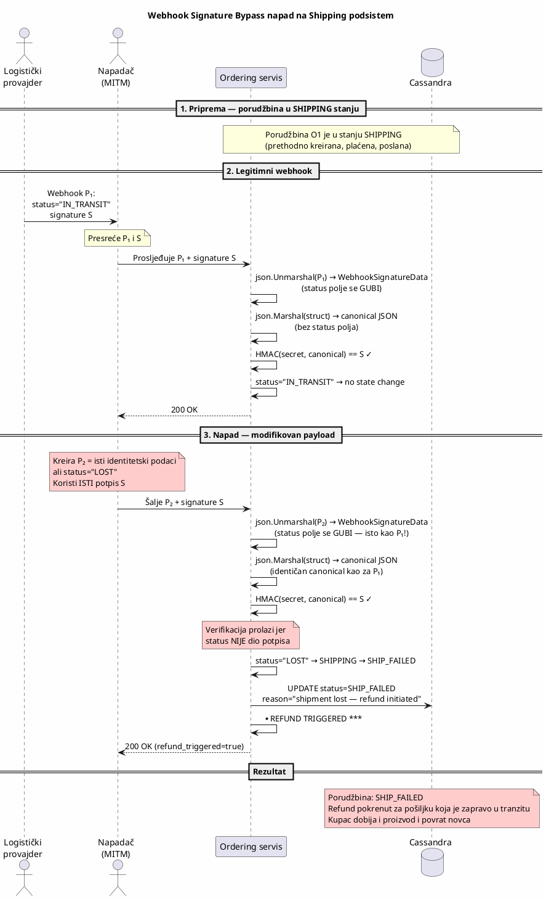

# KT3 — Webhook Signature Bypass napad na Shipping & Logistics podsistem

###### Danilo Cvijetić R225/2025

---

## 1. Uvod

Shipping & Logistics podsistem Temu marketplace platforme odgovoran je za praćenje pošiljki i ažuriranje statusa porudžbina na osnovu callback-ova (webhook-ova) od eksternih logističkih provajdera. Kada logistički provajder promijeni status pošiljke (npr. "isporučeno", "izgubljeno"), šalje HTTP webhook sa JSON payload-om i HMAC-SHA256 potpisom u zaglavlju `X-Webhook-Signature`.

Životni ciklus pošiljke u kontekstu ordering state machine-a:

```
PENDING_PAYMENT → PAID → SHIPPING → DELIVERED
                                ↓
                           SHIP_FAILED (→ refund)
```

Tranzicije iz stanja `SHIPPING` pokreću se isključivo webhook-ovima od logističkog provajdera:
- **DELIVERED** — pošiljka uspješno isporučena kupcu
- **SHIP_FAILED** — pošiljka izgubljena (`LOST`), oštećena (`DAMAGED`) ili vraćena (`RETURNED`)

Kada sistem primi webhook sa statusom `LOST` ili `DAMAGED`, automatski se pokreće refund proces — kupcu se vraća puni iznos porudžbine. Ova funkcionalnost je kritična sa bezbjednosnog stanovišta jer direktno utiče na finansijske transakcije.

Implementacija verifikacije webhook potpisa koristi JSON deserializaciju i ponovnu serializaciju payload-a prije izračunavanja HMAC vrijednosti. Budući da JSON nije kanoničan format, a verifikacijski struct ne uključuje sva polja iz payload-a, napadač može izmijeniti `status` polje unutar payload-a, zadržati originalni potpis i proći verifikaciju, čime se omogućava manipulacija statusima pošiljki i pokretanje neovlaštenih refund procesa.

Ovaj dokument opisuje ranjivost JSON canonicalization-based webhook verifikacije, demonstrira eksploataciju putem manipulacije payload-a, i prikazuje mitigaciju uvođenjem raw-byte HMAC verifikacije.

---

## 2. Definicija pretnje

### 2.1 STRIDE klasifikacija

| STRIDE kategorija | Primjenljivost | Obrazloženje |
|---|---|---|
| **Tampering** | Da | Napadač mijenja sadržaj webhook payload-a (polje `status`) bez invalidacije HMAC potpisa. |
| **Spoofing** | Da | Napadač se predstavlja kao legitimni logistički provajder slanjem lažnih webhook-ova sa validnim potpisom. |
| **Elevation of Privilege** | Da | Napadač pokreće refund proces koji bi trebao biti dostupan isključivo verifikovanim logističkim provajderima. |
| **Repudiation** | Da | Sistem bilježi lažni webhook kao legitimnu tranziciju. Forenzika ne može razlikovati legitimni od lažnog webhook-a jer oba imaju validan potpis. |
| **Information Disclosure** | Ne | Napad ne dovodi do curenja podataka. |
| **Denial of Service** | Ne | Sistem nastavlja da funkcioniše — problem je u integritetu verifikacije, ne u dostupnosti. |

### 2.2 CWE referenca

- **CWE-345: Insufficient Verification of Data Authenticity** — Sistem ne verifikuje autentičnost kompletnog webhook payload-a. HMAC potpis pokriva samo podskup polja, dok se preostala polja (uključujući bezbjednosno-kritično `status` polje) prihvataju bez verifikacije.
- **CWE-347: Improper Verification of Cryptographic Signature** — Kriptografski potpis se ne verifikuje nad sirovim bajtovima poruke, već nad kanonizovanom (nepotpunom) reprezentacijom, čime se potpis efektivno ne odnosi na cjelokupan sadržaj koji sistem obrađuje.
- **CWE-924: Improper Enforcement of Message Integrity During Transmission in a Communication Channel** — Integritet poruke nije adekvatno zaštićen tokom prenosa između logističkog provajdera i ordering servisa.

### 2.3 Opis pretnje

Webhook mehanizam verifikacije koristi Go struct `WebhookSignatureData` za deserializaciju JSON payload-a prije izračunavanja HMAC potpisa. Ovaj struct sadrži samo polja identiteta (`shipment_id`, `order_id`, `event_type`, `timestamp`), dok polje `status` koje određuje da li će se pokrenuti refund **nije uključeno u struct**.

Kada server primi webhook:
1. Deserializuje JSON payload u `WebhookSignatureData` struct — polje `status` se **gubi** jer struct ga ne definiše
2. Re-serializuje struct u kanonički JSON — izlaz ne sadrži `status` polje
3. Izračunava HMAC-SHA256 nad kanonizovanim (nepotpunim) JSON-om
4. Poredi izračunati HMAC sa potpisom iz zaglavlja

Budući da `status` polje ne ulazi u HMAC izračunavanje, dva payload-a sa **različitim statusima** ali **istim identity poljima** proizvode **identičan HMAC potpis**. Napadač može presresti legitimni webhook, promijeniti `status` iz `IN_TRANSIT` u `LOST`, zadržati originalni potpis, i pokrenuti neovlašteni refund.

Dodatno, verifikacija koristi string poređenje (`==`) umjesto konstantno-vremenskog poređenja (`hmac.Equal`), čime se otvara mogućnost timing side-channel napada za rekonstrukciju HMAC vrijednosti.

---

## 3. Afektovani resursi

### 3.1 Ordering podaci — INTEGRITET

Primarni afektovani resurs. Webhook manipulacija direktno narušava integritet podataka o porudžbini:

- **Status porudžbine** se mijenja na osnovu lažnog webhook-a. Porudžbina koja je u tranzitu prelazi u `SHIP_FAILED` bez stvarnog problema sa pošiljkom.
- **Reason polje** bilježi lažni razlog (npr. "shipment lost — refund initiated") koji ne odgovara stvarnom stanju pošiljke.
- **Status historija** bilježi tranziciju `SHIPPING → SHIP_FAILED` pokrenutu lažnim webhook-om, koja se ne razlikuje od legitimne tranzicije.

**CIA triada**: Integritet je kompromitovan.

### 3.2 Finansijski resursi — INTEGRITET

Najkritičniji afektovani resurs sa poslovnog stanovišta. Lažni webhook sa statusom `LOST` ili `DAMAGED` automatski pokreće refund proces:

- Kupcu se vraća puni iznos porudžbine (u demo scenariju: $1,299.99)
- Istovremeno, pošiljka nastavlja put ka kupcu i biva isporučena
- Rezultat: kupac dobija i proizvod i povrat novca — **dupli gubitak za platformu**

**Poslovni uticaj**: Direktan finansijski gubitak. Na skali marketplace platforme sa milionima porudžbina, sistematska eksploatacija ove ranjivosti može rezultovati ogrominim gubicima.

### 3.3 Logistički podaci — INTEGRITET

Status pošiljke u sistemu ne odgovara stvarnom statusu kod logističkog provajdera:

- Sistem prikazuje pošiljku kao "izgubljenu" dok je ona zapravo u tranzitu ili isporučena
- Customer support tim dobija pogrešne informacije
- Automatizovani procesi (npr. re-shipment) se pokreću nepotrebno

### 3.4 Audit logovi — NEPORICANJE

Webhook potpis je validan, pa audit log bilježi tranziciju kao legitimnu. Forenzička analiza ne može razlikovati legitimni webhook od manipulisanog jer:

- HMAC potpis je identičan
- Payload sadrži validne identitetske podatke (shipment_id, order_id)
- Jedina razlika je u polju koje nije pokriveno potpisom

---

## 4. Model napada

### 4.1 Akter napada

Napadač je **eksterni akter** koji:

- Može presresti mrežni saobraćaj između logističkog provajdera i ordering servisa (Man-in-the-Middle pozicija), **ILI**
- Može vidjeti legitimne webhook-ove (npr. putem log aggregation sistema ili kompromitovanog monitoring alata)

Napadač **ne mora poznavati webhook secret** za izvođenje napada — dovoljno je presresti jedan legitimni webhook sa validnim potpisom i modifikovati `status` polje.

### 4.2 Preduslovi

- Webhook verifikacija koristi JSON canonicalization umjesto raw-byte HMAC-a
- `WebhookSignatureData` struct ne uključuje `status` polje
- Napadač može presresti i uhvatiti bar jedan legitimni webhook za ciljnu porudžbinu
- Porudžbina je u stanju `SHIPPING` (webhook se procesuje samo za porudžbine u ovom stanju)

### 4.3 Tok napada



Ključni korak je **korak 4**: kanonička forma `P₂` je identična kanoničkoj formi `P₁` jer `status` polje nije dio `WebhookSignatureData` struct-a. Go-ov `json.Unmarshal` tiho ignoriše polja koja nisu definisana u struct-u, a `json.Marshal` ih ne uključuje u izlaz.

---

## 5. Ranjiva arhitektura

### 5.1 Ranjivi kod — `webhook.go`

Ključna ranjivost je u `computeWebhookHMAC()` funkciji i `WebhookSignatureData` struct-u:

```go
// WebhookSignatureData — struct za HMAC izračunavanje
// RANJIVO: ne sadrži 'status' polje
type WebhookSignatureData struct {
    ShipmentID string `json:"shipment_id"`
    OrderID    string `json:"order_id"`
    EventType  string `json:"event_type"`
    Timestamp  int64  `json:"timestamp"`
    // 'status' i 'details' NISU UKLJUČENI
}

func computeWebhookHMAC(rawBody []byte, secret string) string {
    var sigData WebhookSignatureData
    json.Unmarshal(rawBody, &sigData)      // ← status se GUBI
    canonical, _ := json.Marshal(sigData)  // ← izlaz ne sadrži status

    mac := hmac.New(sha256.New, []byte(secret))
    mac.Write(canonical)                   // ← HMAC nad nepotpunim podacima
    return hex.EncodeToString(mac.Sum(nil))
}

func VerifyWebhookSignature(rawBody []byte, signature, secret string) bool {
    computed := computeWebhookHMAC(rawBody, secret)
    return computed == signature  // ← timing-unsafe poređenje
}
```

Problemi:

1. **`WebhookSignatureData` ne sadrži `status` polje** — polje `status` se gubi pri deserializaciji u struct. Re-serializacija proizvodi JSON bez `status` polja. HMAC se izračunava nad nepotpunim payload-om.
2. **JSON canonicalization umjesto raw-byte HMAC-a** — čak i da struct sadrži sva polja, canonicalization pristup je fundamentalno pogrešan jer server ne verifikuje stvarne bajtove koji su poslani, već kanonizovanu reprezentaciju.
3. **Timing-unsafe poređenje (`==`)** — string poređenje omogućava timing side-channel napad za postepenu rekonstrukciju HMAC vrijednosti.

### 5.2 Demonstracija kanonizacije

Payload od logističkog provajdera:
```json
{"shipment_id":"S1","order_id":"O1","event_type":"status_update","status":"IN_TRANSIT","timestamp":1700000000}
```

Kanonička forma nakon `json.Unmarshal` → `WebhookSignatureData` → `json.Marshal`:
```json
{"shipment_id":"S1","order_id":"O1","event_type":"status_update","timestamp":1700000000}
```

Napadačev modifikovan payload:
```json
{"shipment_id":"S1","order_id":"O1","event_type":"status_update","status":"LOST","timestamp":1700000000}
```

Kanonička forma (identična!):
```json
{"shipment_id":"S1","order_id":"O1","event_type":"status_update","timestamp":1700000000}
```

HMAC oba payload-a je **identičan** jer se izračunava nad istom kanoničkom formom.

---

## 6. Demonstracija napada

```bash
chmod +x attack.sh
./attack.sh http://localhost:8080
```

Skripta kreira porudžbinu, provodi je kroz stanja do `SHIPPING`, zatim šalje legitimni webhook (`IN_TRANSIT`) i modifikovani webhook (`LOST`) sa istim HMAC potpisom. Ključni korak je korak 6 — isti potpis prolazi verifikaciju za oba statusa jer `status` polje nije dio HMAC izračunavanja.

```
=== Webhook Signature Bypass Attack ===
Target: http://localhost:8080
Secret: super-secret-webhook-key-2024 (from docker-compose.yml)

1. Created order 46210f2b-... (total=$1299.99)
2. Paid order (PENDING_PAYMENT -> PAID)
3. Shipped order (PAID -> SHIPPING)
4. Computed HMAC over canonical form (without status field)
   canonical: {"shipment_id":"SH-46210f2b","order_id":"46210f2b-...","event_type":"status_update","timestamp":1700000000}
   signature: eb0a3473e5aa...
5. Sent webhook status=IN_TRANSIT  -> HTTP 200
6. Sent webhook status=LOST       -> HTTP 200 (same signature!)

--- Results ---
  Order:    46210f2b-...
  Status:   SHIP_FAILED
  Reason:   shipment lost — refund initiated (shipment SH-46210f2b)
  Refund:   true

VULNERABLE: signature bypass succeeded, refund triggered ($1299.99).
```

Korak 5 i korak 6 koriste **identičan HMAC potpis**, ali sa različitim `status` vrijednostima. Oba prolaze verifikaciju jer potpis pokriva samo identitetska polja, ne i sadržaj pošiljke.

---

## 7. Mitigacija

Mitigacija se postiže zamjenom JSON canonicalization pristupa sa **raw-byte HMAC verifikacijom**. Patch se nalazi u `fix.patch` i mijenja isključivo `webhook.go`. Tri ključne promjene:

**1. HMAC nad sirovim bajtovima** — umjesto deserializacije u struct i re-serializacije, HMAC se izračunava direktno nad sirovim bajtovima HTTP request body-ja. Ovo garantuje da **svaka** izmjena payload-a (uključujući `status`, `details`, whitespace, key ordering) invalidira potpis.

**2. Konstantno-vremensko poređenje** — umjesto `==` operatora koji leakuje informaciju o dužini i sadržaju putem timing side-channel-a, koristi se `hmac.Equal()` koji izvršava poređenje u konstantnom vremenu.

**3. Uklanjanje `WebhookSignatureData` struct-a** — struct koji je uzrokovao gubitak polja tokom canonicalization-a je potpuno uklonjen. Više ne postoji posredni korak deserializacije/serializacije.

Ispravljena verifikacija:

```go
func VerifyWebhookSignature(rawBody []byte, signature, secret string) bool {
    mac := hmac.New(sha256.New, []byte(secret))
    mac.Write(rawBody)          // ← HMAC nad KOMPLETNIM sirovim bajtovima
    expected := mac.Sum(nil)

    sigBytes, _ := hex.DecodeString(signature)
    return hmac.Equal(expected, sigBytes)  // ← konstantno-vremensko poređenje
}
```

### Primjena i revert

```bash
# primjena
patch -p0 < fix.patch
docker compose build ordering-service --no-cache
docker compose up -d ordering-service

# revert
patch -R -p0 < fix.patch
docker compose build ordering-service --no-cache
docker compose up -d ordering-service
```

---

## 8. Demonstracija mitigacije

```bash
./attack.sh http://localhost:8080
```

Očekivani rezultat — skripta koristi HMAC izračunat nad kanoničkom formom (bez `status` polja). Nakon primjene patch-a, server izračunava HMAC nad **sirovim bajtovima** kompletnog payload-a, pa se potpisi ne poklapaju i **oba webhook-a bivaju odbijena**:

```
=== Webhook Signature Bypass Attack ===
Target: http://localhost:8080
Secret: super-secret-webhook-key-2024 (from docker-compose.yml)

1. Created order 37c2e4ef-... (total=$1299.99)
2. Paid order (PENDING_PAYMENT -> PAID)
3. Shipped order (PAID -> SHIPPING)
4. Computed HMAC over canonical form (without status field)
   canonical: {"shipment_id":"SH-37c2e4ef","order_id":"37c2e4ef-...","event_type":"status_update","timestamp":1700000000}
   signature: 7a05276b2255...
5. Sent webhook status=IN_TRANSIT  -> HTTP 401
ERROR: legitimate webhook rejected (HTTP 401)
```

Potpis koji je izračunat nad kanoničkom formom (podskup polja) više ne prolazi verifikaciju jer server sada izračunava HMAC nad kompletnim sirovim bajtovima. Svaka izmjena payload-a — uključujući dodavanje, uklanjanje ili promjenu bilo kog polja — invalidira potpis.